## A Walkthrough of the [Ino](https://www.vulnhub.com/entry/ino-101,601/) VM from Vulnhub

As this is a beginner-level machine I'll try to discuss in more detail a lot of the things I'm doing and why.

so first of all, with both the Kali VM and the Ino VM booted and running, we need to find the Ino IP address. so we do this using nmap, which scans a network for devices and then finds which ports are running. For now we'll use an "-sn" flag to turn off the port scan as we're just looking for IP addresses. When I set up my Nat Network I gave it the IP range of 10.0.2.0, so that's what I'll scan using this:

`nmap -sn 10.0.2.0/24`

[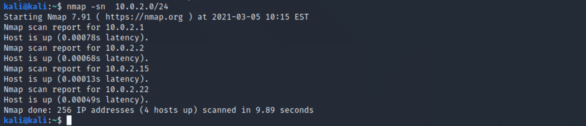](../images/ino/0.png)

Usually you'll be looking for the highest IP address, so in my case that's 10.0.2.22

Let's do a full port scan to see what it's running. Here I will use the "-p-" flag to scan all ports rather than the 1000 most common ones, and tell it to do a little extra delving into them using "-A"

[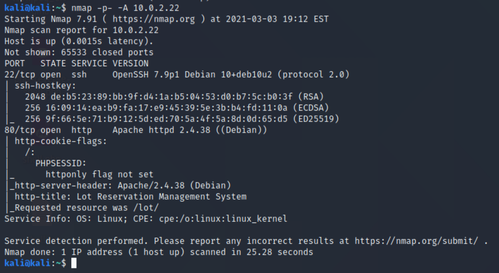](../images/ino/1.png)

Here we can see that ports **22** (ssh) and **80** (http) are open. So let's visit port 80 in our web browser and see what we're dealing with:

[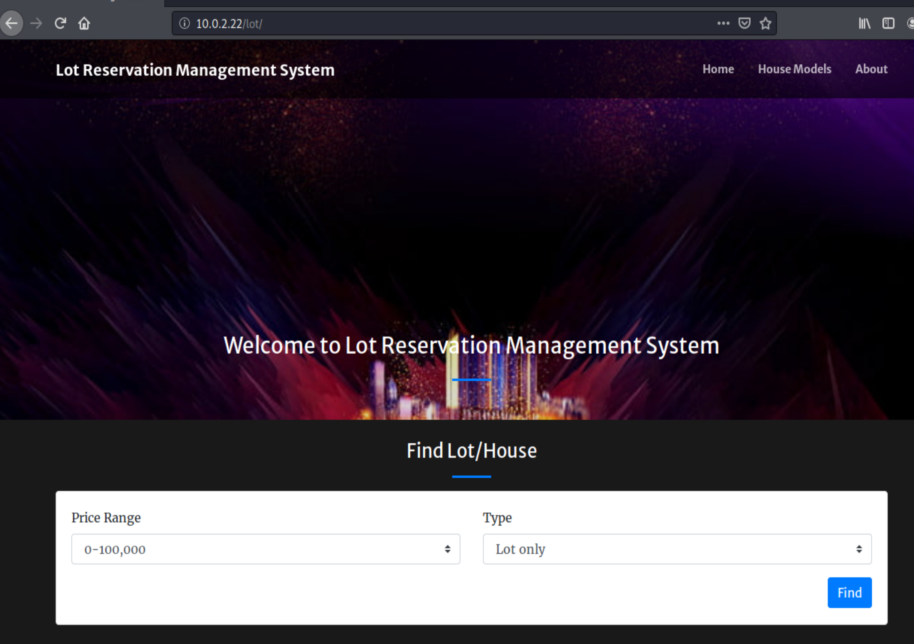](../images/ino/2.png)

Usually here we would do some extra reconnaissance using directory scans and the like, but there is rae-limiting in place so that's a dead-end.

We can see from the site that it's running "Lot Reseveration Management System". Here we find some auth bypass vulnerability:

so from this first of all we learn the location of an admin login page:

[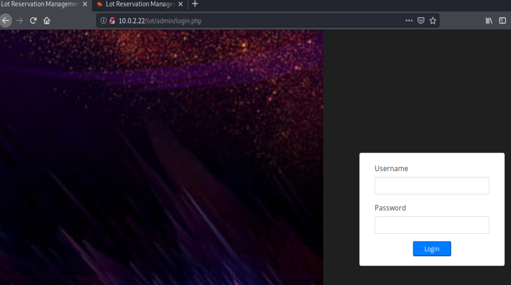](../images/ino/4.png)  

Before going down the road of an SQL Injection, I did the standard check first for default credentials, in case the admin hasn't changed them:

  

And using **admin**:**admin123** actually logs us in as the admin:

[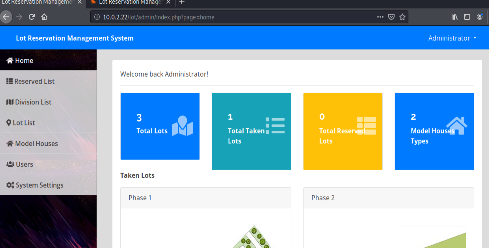](../images/ino/6.png)   

After looking around there's not much we can do here, except that there's an image upload section:

[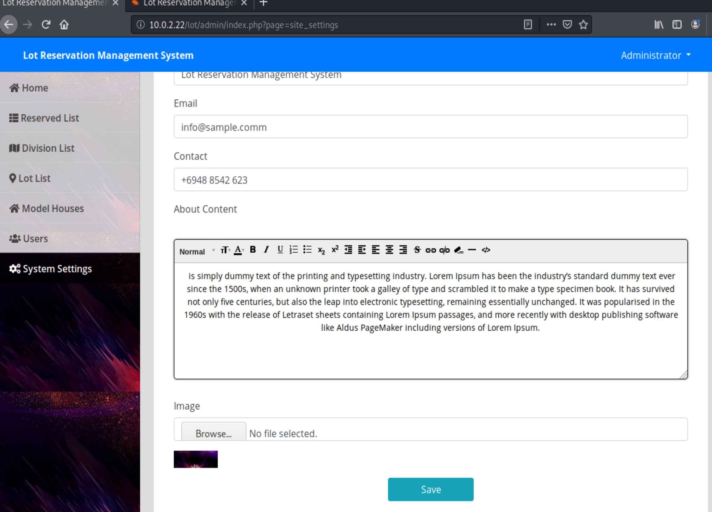](../images/ino/7.png)

So instead of uploading an image, we're going to try and upload some PHP code and convince the site to execute it.

Kali comes bundled with a lot of templated shells you can use already, in `/usr/share/webshells/php` we can find some very good ones ready to use:

[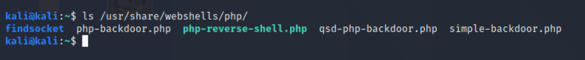](../images/ino/7-1.png)  

I love the php-reverse-shell one:

[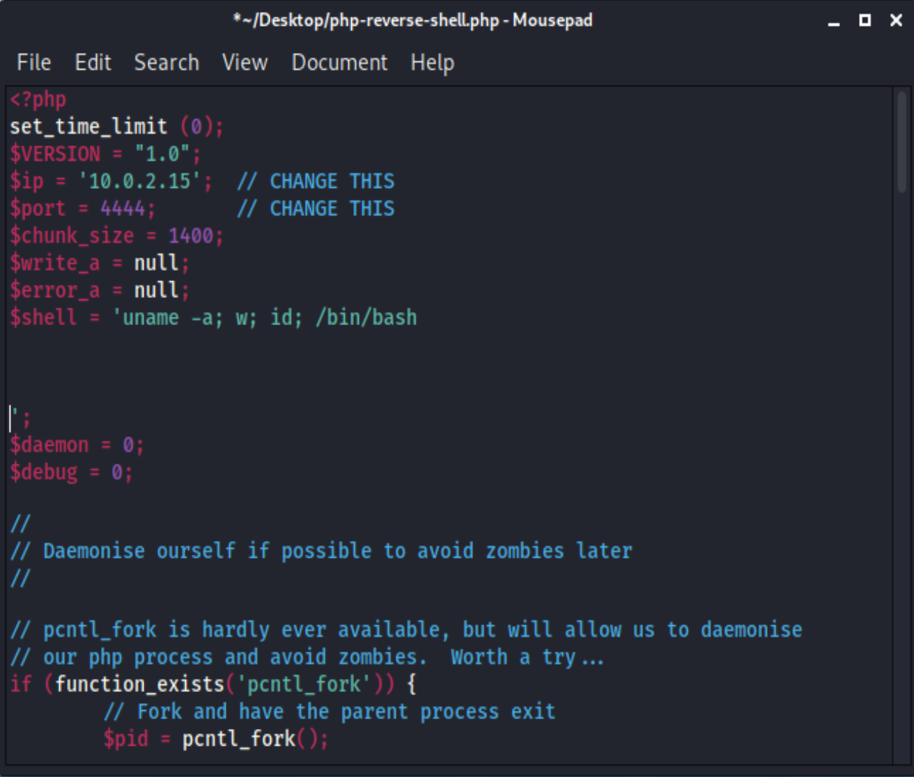](../images/ino/7-2.png)  

so I copy this to my Desktop and change the IP address to my kali machine. I had limited success when it tried to run "sh", so I also changed this to "bash" for this machine.

Now we try to upload this. Usually we might have to trick the site into thinking it's an image, but this software doesn't even check that.

What's going to happen is that the site will automatically display an image after it's uploaded, or in our case, execute our PHP. This PHP script will try to contact our kali machine to set up a connection, so first, let's tell kali to listen on the port I used in the webshell file:

`nc -lvp 4444`

And then we upload the file and watch how it tries to display it:

  

(Note: you can right-click the broken image icon above and copy image address and visit that address manually in your browser if you need to re-execute your shell code)

Our listener successfully connects to the machine:  

[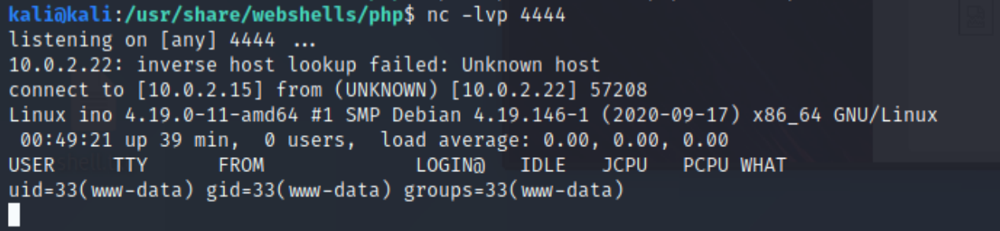](../images/ino/9.png)  

Here we see that are the **www-data** user. This is the user the machine uses to run the web application, it's not very powerful permissions-wise so we want to find a better user to move on to. This is called "Privilege Escalation".

We also have a pretty rubbish shell interface, so we use a useful snippet of python to get us a proper TTY shell:

`python -c 'import pty; pty.spawn("/bin/bash")'`

[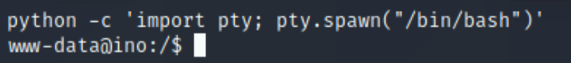](../images/ino/10.png)  

**Make a note of this** you will use it regularly for other machines.

Let's have a look around in the **home** directory to find other users:

[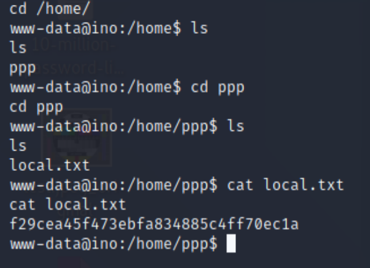](../images/ino/11.png)  

That "local.txt" is a flag, we use it in these kinds of VMs to prove we've gotten this far in the process. It does show us that there's a ***ppp*** user. when we view **/etc/passwd** we see that they're allowed to log into bash shell to execute some VPN software, so after searching around the internet I find where that bit of software stores its password:

[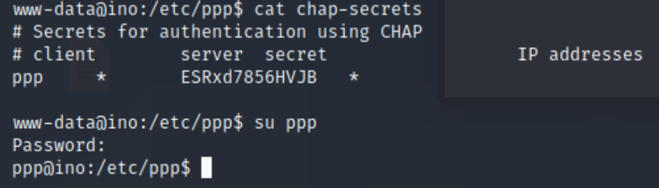](../images/ino/12.png)    

**su ppp** let's us switch to that user, but remember we're doing this through a php shell which is going to slow things down and possibly make it unstable. Once I saw that this passwords works, I changed the password using **passwd** (Because it's so swkward to type out) quit and ssh'd in as that user using

`ssh ppp@10.0.2.22`

next we want to see what this user can do that www-data can't, the easiest thing to try is **sudo -l** to see if this users has special permissions over any programs in particular:

[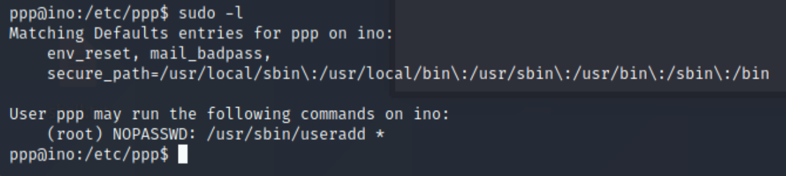](../images/ino/13.png)

So what this means is that this user can run a program called **useradd** as if they were the root user. Useradd give us a clue as to what we're going to do; try to create a new user who has all the permissions of the root user then we have total control of the machine.

Now, when we create a user we can't log in as them, so we need to defined the password as the user is created. Annoyingly we have to supply an encrypted password, after some searching I found a python snippet that will work:

Now let's create the user. I gave it th eusername vulnhubroot, though obviously this can be anything, then I added it to the **root** group and the **sudo** group as well:

`sudo useradd -m -G root,sudo -p papAq5PwY/QQM vulnhubroot`

[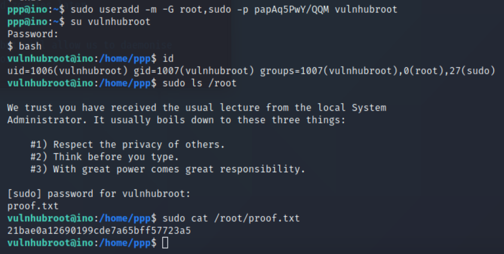](../images/ino/15.png)

Then as we can see, using this we are able to go into the root  user's home directory to see the last flag to prove we have ownership of the machine.  
