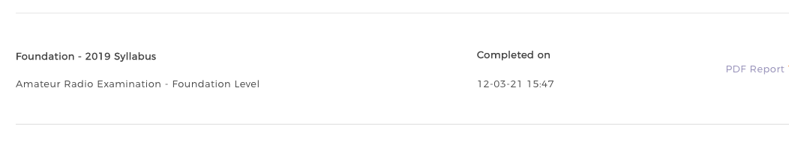
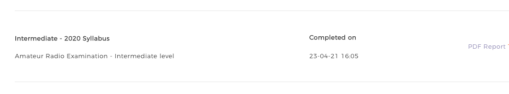

## My introduction to amateur radio

I got into amateur radio as a technical interest primarily. I can summarise it as a cross between physics and technology and design classes.

There are 3 levels to the UK licence, I'm now on the 2nd, that process taking maybe 3 or 4 months. I can summarise the first as a physics/technology and design key stage 3 level, with the intermediate being both around A-level. I'll say now that this is for the casual reader who has no idea about ham radio and is interested in what to expect.

  

My certs above are pretty close together, I think I took about 3 weeks to study for the foundation since it was very ground-up, and due to a newborn I had a lot of freetime until about 4am every morning. Like I said it's very technology and design oriented (eg ohm's law) with some physics in there (eg how to calculate a wavelength). I took a week's break and then spent another 2 weeks studying for intermediate.

My tests were taken during lockdown so all remote and proctored, with full licensees proctoring the exams. For the foundation exam you get 60 minutes and the intermediate was 90 minutes. Due to a dodgy tethering connection I did them in 10 and 20 minutes respectively so they're not as intimidating as they look from the workbook if you study regularly.

I used the Android app "Amateur tests" for (unofficial) practice exams and [This "Getting tae grips"](https://gm6dx.thinkific.com) website as an accompaniment for the intermediate course. A lot of the more low-level electronics concepts are better explained through animations than the text and static diagrams in the official book so it made everything click into place.

The academic aspects are one thing, and any engineer will love the studying and exams, but the beauty of amateur radio is the access to support you have built-in when it comes to the practical engineering.

You know in theory what antennas and feeders and all sorts you'll want to use, but the details of that are obviously very specific to your situation.

As well as online help, you can just put out a call on the radio and you've instantly got people within a couple of miles who can give advice and recommend local shops and installers and have a back and forth around any confusing topics.

As hobbies go it was one built for the whole covid situation really!

[Repeaterbook](http://repeaterbook.com) is the best resource for finding local repeaters. Although I found a good echolink gateway about 20 or so miles away, I searched in the simplex section and found one just down the road so it's worth looking there too.

I haven't got into HF yet, but even before I got my foundation I had a Baofeng UV-5R costing about 25 quid (later upgraded to an also-cheap Yaesu FT-4x), and with a local fella's simple echolink (ie internet radio) gateway that cheap radio was connecting internationally on 5 watts.

I've since got a rooftop antenna for dualband (2m/70cm) and a cheap (you can sense a pattern here) Yaesu FTM7250 so I can go up to the 50 watts my current licence permits.
