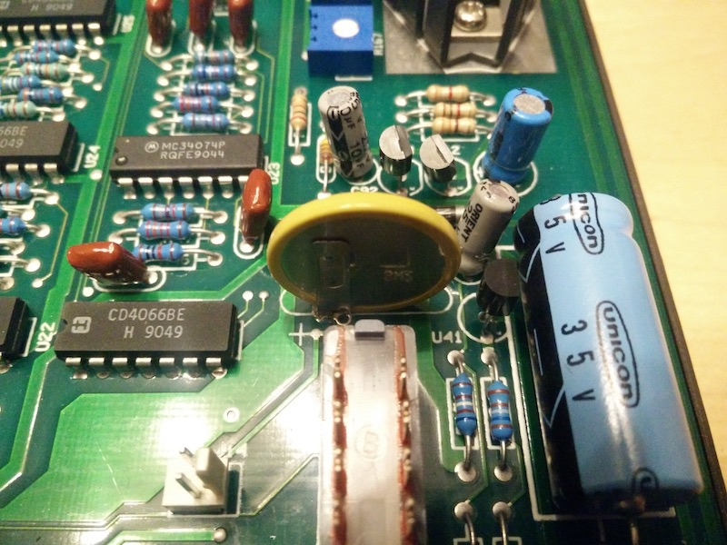
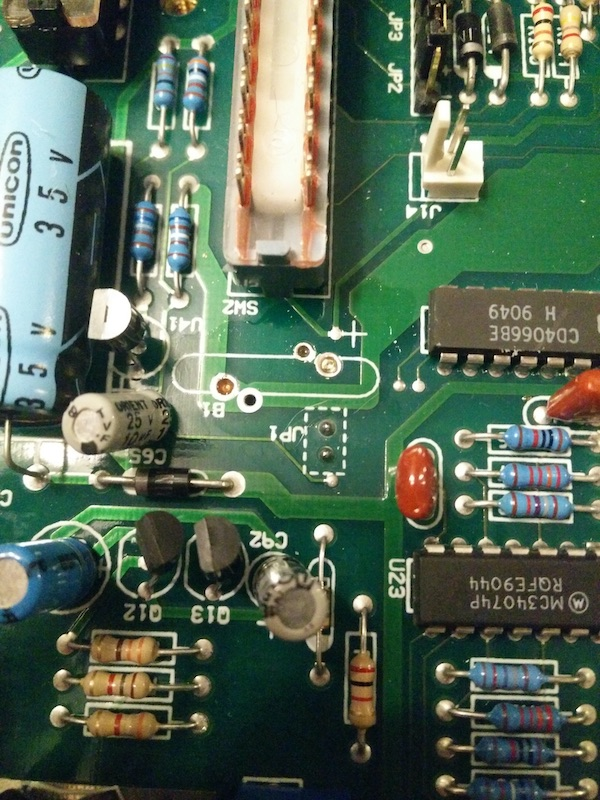
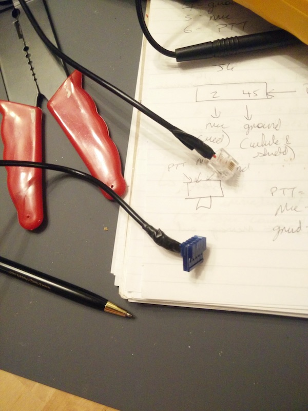
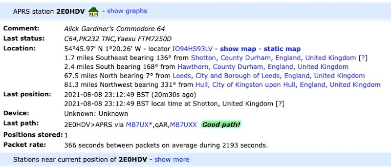
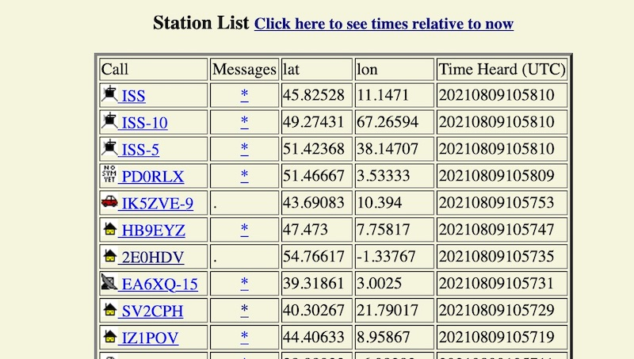
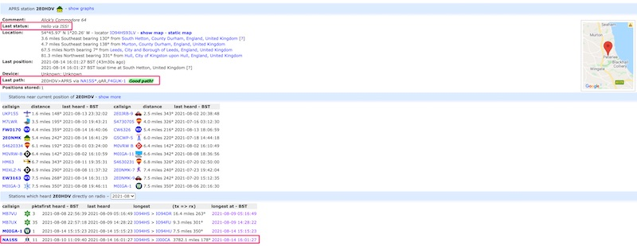
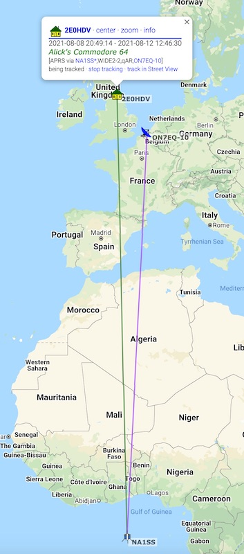

## Using the ISS digipeater from a Pakratt PK-232MBX TNC, Yaesu FTM7250 and Commodore 64

After getting my Amateur radio licence I was wondering what to do next and noticed that my Commodore 64 was sitting right next to my Transceiver and remembered when researching my BBS [See previous blog post]() that there were packet radio BBSs. Packet radio to a BBS probably isn't practical since I'd be the only person in the local area using it, but packet radio (Sending/receiving data packets via radio instead of through the internet) was an interesting idea, and the fact that the International Space station has a repeater for packet radio seemed like a good final objective.

This is the theory: with VHF the higher the better. It usually only lasts a few miles and hills, buildings etc block the signal. But a repeater can rebroadcast your message if it hears it, thus extending the range.

Imagine a repeater on a mountain! it can receive and rebroadcast so much! Now go further imagine a repeater so high up that it's in space, even the humble VHF can reach insane distances!

At the time, computers such as a C64 would make use of a TNC (Terminal Node Controller) to be the brains of the operation and then as a modem. AEA released a PK-64 specifically for the C64, but they're pretty rare and its big brother the PK232 seems more advanced and had a lot of upgrades since first release so I picked one of those up for £20.

Note that this writeup won't assume a lot of prior knowledge. As a lot of this hardware is 30-40 years old it can be tough scraping together relevant bits of information from many disparate sources among the dead links or discovering it yourself so I'm going to go into a lot of detail here for the next person.

### Setting up the C64 and Pakratt

First of all, the Pk232 needs to connect to the C64 via an RS232 serial cable. There are adapters for the C64 user port to support this. Thing is I also needed the power supply provided by the user port for the sd2iec to read my terminal program (Novaterm9.6c) but fortunately I had already a userport-saver, which divides the userport into a normal port and a separate 5v power supply so both the sd2iec and PK232 can be used at once (I had previously used this for a terminal program and a wifi card)

And then onto the PK232:

When we open it up we can see here that the CR2032 backup battery is soldered onto the board itself, This one is at least 31 years old (As that's the current ROM version) so I'll remove that to prevent any battery leakage and then replace it with a battery holder to futureproof it.

Usually I've seen these batteries suspended an inch or so above the board, but this one seemed to have its legs trimmed so that it was right down against the board, with the soldering pretty hard to reach at the back as it was under the battery:

So what I did was use a penknife to gently pry the contacts off the battery itself

Then I desoldered this and cleaned the traces underneath

Then I bent the pins of the battery holder flat and soldered this as a surface mount where the original battery was

Now on the C64 we set up Novaterm to use the correct port for RS232 and recognise the PK232 as a Modem. The basics are a Hayes-compatible modem, 8 bit no parity 1 stop bit (8N1), Normal Carrier type, baud rate 1200 and a serial driver of user port.

Here are my settings if anyone needs to refer to them.

And now both are talking to each other (After we send '*' for the TNC to configure itself to talk to the C64)

   

### Receiving packets

The receive test is very easy. The audio out from the FTM7250 transceiver and the RX-IN on the back of the PK232 can be connected using a 3.5mm mono audio cable. Tune to your local APRS frequency (Consult your band plan, in the UK this is 144.800MHz) then we switch to packet mode by typing "packet" and the the local APRS broadcasts are decoded (The frequency demonstrated here is 145.825MHz; the one the ISS uses but you have to time it right to receive):

Here we are seeing the raw APRS data, this is because the PK232 uses the AX.25 data protocol which APRS is built from.  

### Transmitting packets

This gets a little more complicated. First of all, we need to connect the PK232 to our transceiver so that it can broadcast out the audio it generates and trigger the PTT (push-to-talk). The Yaesu FTM7250 doesn't have a dedicated data or APRS port, so we're going to have to hack the PK232 into the microphone port.

The pinouts for both devices are publicly available (The Yaesu MH-48 plug that the FTM7250 uses is used across several other Yaesu models so is equally valid for those), So we link them up according to the diagram below (you can tell I'm not very artistic. the blue box in the middle is meant to be a shielded cable).

The Yaesu requires an RJ12 plug (NOT RJ11, which only has 4 pins) and the PK232 requires a 5-pin female IDC (Other people have used dupont connectors for this but I was able to easily find IDCs on ebay). The cables that I used are 26AWG shielded (2 cores, or 3 cores if there isn't a dedicated ground wire), I believe 24AWG would be fine too. I tried two versions, one where I had to use one of the core cables as ground and link one side to the shielding (As in the diagram) and another where the cable had an uninsulated ground lead inside (This one was a guitar pickup cable) and both worked fine.

I also made a 3rd cable where it branched off from the IDC into a seperate home-made 3.5mm mono plug for the received audio out of the transceiver (with both cable shields soldered together) which also worked, but you have to increase the transceiver volume a bit. The simplest way of a separate receiving audio cable such as we used for our receive test is actually the best way.

To connect the IDC I used an IDC punchdown tool (Some "helpfully" come with automatic snips attached but I removed these so it'd fit into the connector) and to connect the RJ12 I just used an RJ12 crimper. It makes life very easy to have a continuity tester on hand as well to test the plugs are properly connected throughout the cable to their respective partner pins, Otherwise if something doesn't work you're working blind as to why; with all the cables I made for this project (including spares) there was usually a wire that hadn't punched down into the IDC properly.

#### A note regarding the DCD (Data carrier detect) setting on the Pakratt

Your TNC won't broadcast if it is currently receiving a packet, so we want to fine tune this a little bit so the TNC knows when it is receiving an actual packet and when it's just noise.

Firstly, observe the signal bar on the transceiver. When you see data coming through turn the transceiver volume up or down so the cool Knight Rider "Tune" light display just fills the display end-to-end.

When the DCD LED is lit, the Pakratt thinks there is a data packet incoming. If your transceiver is showing no incoming signal but the DCD is lit, then the threshold is too high. Slowly turn the dial to the left until this light just disappears. Now when a true signal is received it will light up to show it is recognised correctly.

This means you won't be blocked from transmitting by static noise wrongly interpreted as an incoming data carrier (threshold too high), nor will you be missing data packets coming in and therefore transmit out uselessly when the ISS is already busy dealing with someone else (threshold too low).

#### A note about data formats and relevant commands before we transmit

As mentioned before, the PK232 sends packets as AX.25, and APRS builds onto this, so we can handcraft our packets to appear as native APRS to whoever receives and ingests them.

These are the relevant examples of PK232 terminal commands for LOCAL (not ISS) broadcast so we can test our transmit ability. The required commands are MYCALL, BTEXT, BEACON and UNPROTO:

>mycall xxxxx

Where xxxxx is your callsign. The PK232 will not switch to transmit mode without a callsign to transmit on behalf of. By law you must have an amateur radio licence to gain a callsign from your national communications authority.

>unproto aprs via wide2-2

Unproto sets the route of your packet, wide2-2 says "Two large repeaters broadcast this", usually you'll get onto the internet that way. There are lots of sites discussing routes, but wide2-2 is generally the basic accepted form.

>btext =12345.67N/1234567.89W-yyyyy

btext is your beacon text. Here is a basic schema:

[here](http://www.aprs.org/doc/APRS101.PDF) is the source if you're interested in more of the APRS format or the various btext variations  

Let's break down the format of our example here:

**=** Tells the recepient that we are a message-capable fixed station.

&nbsp;&nbsp;&nbsp;&nbsp;&nbsp;&nbsp;alternatives are:

&nbsp;&nbsp;&nbsp;&nbsp;&nbsp;&nbsp;/ message incapable fixed Station

&nbsp;&nbsp;&nbsp;&nbsp;&nbsp;&nbsp;@ mobile, message capable

&nbsp;&nbsp;&nbsp;&nbsp;&nbsp;&nbsp;! digipeaters

**12345.67N** Your position latitude. The C64 obviously doesn't have a GPS so I just found the co-ordinates of the local Home Bargains from google maps so that people can find top brands at bottom prices. Note that the .67 component is in hundredths rather than minutes, so divide by 60 if you need to. you can also use a Maidenhead Grid Square reference to replace the latitude and longitude, and is also good for privacy as it encompasses a large local area.

**/**   The symbols set you want to use [Information on symbols can be found here](http://www.aprs.net/vm/DOS/SYMBOLS.HTM)

**1234567.89W** Your longitude position (note that is contains more characters than the latitude so you may need to zero-pad the beginning)

**note that when you see other people's locators they may look like gibberish, this is because they are being encoded for efficiency by modern transceivers**

**-** this symbol is combined with the / symbol set identifier from earlier to form /- , which translates as a house icon. [Information on symbols can be found here](http://www.aprs.net/vm/DOS/SYMBOLS.HTM)

**yyyyy** the text headline you want your beacon to have (I will show later what this looks like when ingested; in later examples YYYYY will me replaced by "Alick's Commodore 64")

>beacon every x

this tells the pakratt to broadcast the beacon every x * 10 seconds (eg "beacon every 90" broadcasts every 900 seconds)

This is enough for beacons. To do statuses or messages we need to switch from command mode to converse mode using the converse command:

>conv

You can now send a status update like this:

\>xxxx

where xxxx is your status, again I'll show later how this looks. The > prefix is required for some transceivers to parse correctly so it's usually best to include it.

to send a message follow this format:

>:XXXX_____:HI!!

begin with a : then the callsign of the person you're messaging, pad this callsign field out to 9 characters with spaces, then another : to end the "to" field and type your message (ie your message will begin at the 12th character). The callsign XXXX must be in capital letters.

#### optional commands

(These are done in command mode)

>daytime yymmddhhmmss

set the datetime for your TNC (optional) this will allow you to see timestamps of when messages were received (the seconds part may be ommitted)

>mheard

This will show stations your TNC has heard.

Now let's set a beacon (along with a status) and see what happens. For this example, my beacon test is "Alick's Commodore 64" and my status text is a list of my equipment. The site that will ingest it from an internet gateway is [aprs.fi](https://aprs.fi)

We can also see the two hops the broadcast made (As requested by wide2-2) to get to a station that was gatewayed to the internet to update this page. Note also the houses icon symbol we specified. The distance limitation of VHF is evident here to a few miles which is why we need repeaters to take our signal and rebroadcast it. (This is what the ISS will later do it for us which much greater coverage!)

Clicking info shows further details:

So this all shows that we can broadcast locally on 144.800MHz!   

### Now let's transmit to ISS

First of all, we need to see when the space station will appear near us, what direction is will rise and set in and what elevation (angle over the horizon). I use an Android app called "W1ANT" (Which shows other radio-capable satellites also) which also has a handy real-time position report:

I'm using a roof-mounted dual-band vertical antenna, so while the ISS is overhead I'm deaf to it and can't transmit to it (It would be a massive inefficency if my antenna was beaming my signals upwards into space!) so I generally have success with the ISS at around 15 degrees elevation +/- 13 or so degrees depending on the direction due to local terrain.

Here are the TNC setup changes we need for the ISS:

>Unproto aprs via ariss

"ARISS" is a callsign that the ISS will be looking for, so instead of the local repeaters from before we will be using the space station as our repeater! (it's best not to include wide2-2 here, just to avoid unnecessary repeater noise on the ground as the signal from the ISS will hit quite a few at once)

>beacon every 6

This will set the beacon to 60 seconds (generally your ISS exposure will be 2-10 minutes so a 15 minute beacon frequency might miss it. Use a higher beacon frequency of 20-30 seconds if you're using low power, eg 5-10 watts).

**NOTE: There is a matter of etiquette here. This is a simplex frequency, meaning that while the ISS is handling your request it's locked and can't do anyone else's so the more reliable your transmissions are the less frequent your beacon should be to give other people a chance. My antenna isn't designed for satellites, but even so if my beacon is recognised I turn off further beaconing (the "beacon every 0" command will do this).** Otherwise the transmission you block may be a school's experiment, a newcomer trying to figure it out or someone using a low-powered handheld transceiver. You can still send messages to other people to say you've heard their call when your beacon is set to 0, ie not beaconing.

\>Hello via ISS

this is just a status update for whatever you want to show on aprs.fi when your beacon updates it, but it isn't necessary, and in fact it's probably best to leave it out so you're trying to send less data to the ISS.

and now you can monitor [ariss.net](https://ariss.net) to view contacts acknowledged by the space station and see a cool map view, I really love the line-art of the map! so fortunate that it was used because google priced them out of using maps. (in these screenshots my callsign is 2E0HDV):

  

In the raw text above (NA1SS is the ISS callsign, the * after it shows it repeated the message) we can see my broadcast highlighted in green and another station shown in red sending me a message back to say they've received it. The "EA" callsign above these is Spanish, giving us a demonstration of how useful a repeater a satellite is for increasing our range with a simple VHF antenna. Notice also that (as mentioned earlier) the EA callsign locator has that gibberish look meaning it was encoded by modern software, the packet is actually fine but the locator portion isn't human-readable, the makes it more efficient by sending less data.          

If we go back to aprs.fi some cool changes have happened, First of all, my "path" to the internet has been updated to include the ISS as a station that has heard me (Click to enlarge):

Look at the distance! This shows that even on VHF, broadcasting from the UK to ISS for it to rebroadcast covers a huge area of Europe, far more than the 15 miles or so we were managing on our local transmit test.

We can show this path on the map like we did with our local test:

  

## Next Steps

- To give me horizon-to-horizon coverage and remove the deadzone directly above the house my next step is to build an antenna more suited to satellite use, my current solution is a Quadrifilar helicoidal (QFH) antenna intricately woven from big copper pipes.

- Stations who have interacted with ISS using any of the supported modes (SSTV - which sends pictures of radio, voice, packet) can have this officially confirmed with a QSL card, basically a postcard showing the time and mode of contact so I definitely need this for the wall!

- I have a Psion 5MX from around 2001 which I'm pretty sure can also communicate with the PK232 over a terminal session, onto an LCD screen powered by AA batteries! I'm just awaiting the proprietary RS232 cable  
