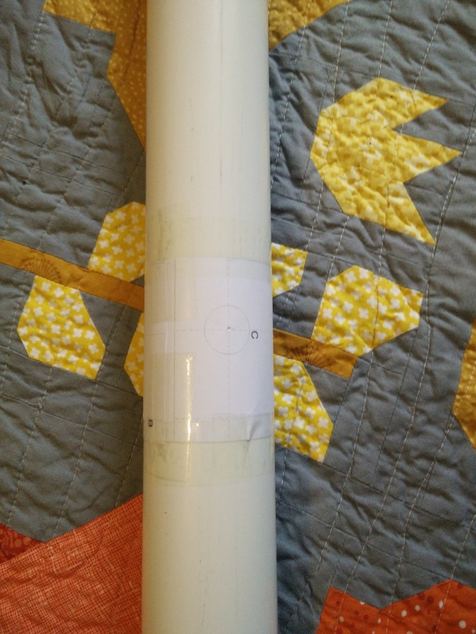

## Upgrading the ISS setup to use a Quadrifilar helicoidal antenna

In [my last post]() I set up a TNC to use the ISS digipeater to send packet data over the radio using a dual band whitestick antenna. As noted at the time, This gives me usable coverage at the horizons for a very limited amount of time, but leaves a blind spot above my house (when the ISS would be in its longest arc) where I can't transmit or receive.

After some research I decided to build a QFH antenna using [John Coppens's QFH calculator](http://jcoppens.com/ant/qfh/calc.en.php) which should provide horizon-to-horizon coverage.

### Constructing the body

I was in two minds as to whether to use a 55mm waste pipe or a square downipe for my main body. I was leaning toward the square downpipe but I already had some spare wastepipe, if I was to do it again I think I would've waited to order the square option, which would allow the PVC glands I used to make use of their screw-on backs and would make mapping out the 4 cardinal points easier.

For the loops I used 3/4" copper, with an equal tee at the bottom of the long loops to feed through the RG58 coax.

First I line up the drilling holes:

Now I inserted the PVC glands to hold the horizontal piping in place.

As you can see, because the waste pipe is circular the backs won't fit onto the glands, but they're fit very snugly since I had to file the holes for them to fit, and I used some PVC glue on them anyway:

Next I cut and inserted the horizontal piping for the short loops, to cut I used a small copper pipe cutter which is really cool

Here we can see that although it seems logical to just use one continuous pipe for the bottom of the long loop, it's easier to just cut a gap and insert an equal tee for the coax (ensuring the final length still matches up with the calculator measurements). The equal tee is just held in place by the pipes inserted at either end; it's not welded in or anything, but both the glands and rest of the loop will keep them in position

Next we cut (I used a hacksaw) and bend the rest of short and long loops, fitting them to our horizontal pipes using 90 degree elbow joints

Here with my helper we can see the finishing touches; I've soldered the joints and loops together using a blowtorch and 3mm gauge solder wire, added a rubber top to prevent any rain getting in (I also used some silicone sealant around the glands), clamped it to a bit of steel as a mast and then seated this in a weighted flowery parasol base.

I didn't want to feed the coax through the copper as it would be melted by the blowtorch when I was welding the joints together.

To get this coax through after welding from the top of the long loop down through the equal tee I installed earlier, I used a fishing line tied to a nut which dropped through the entire system easily. Dragging the coax afterward was initially difficult, but using vaseline on the first 6 inches of coax allowed it to pull through easily with no snagging or resistance at all, even at the three 90 degree bends (two elbows and the tee).

It was also my first time soldering both pl259 and so239 connectors, the videos I used are [here for the PL259](https://www.youtube.com/watch?v=DWIKgI62M_8) and [here for the SO239](https://www.youtube.com/watch?v=96CqtaKS0Qg).

What you can't see is the internal wiring of the coax to the loops, but this just follows the same map given on John Coppens's page linked earlier.

I put the final result onto a flat bit of roof for testing:

  

### Testing the Antenna on the ISS

When connected the Antenna had a promising SWR of around 1.1-1.2

The transmit and reception on the antenna are pretty similar, and although I've lost the low-angle coverage which was all the vertical whitestick could manage, above about 25 degrees the coverage is amazing (understandable since my QFH is about 15 feet lower than my vertical for testing so some horizon coverage will also be lost due to walls and houses). On my first test my beacon went out, someone replied to acknowledge it, I thanked them and they acknowledged the message.

Not only did my signals get out reliably, but I actually saw the ISS digipeat my messages out too, so rather than the old antenna receiving some messages (never my own) and get signals out in a bit of a flakey manner (Which I had to check on ariss.net to see if they'd been picked up) I was able to perform the entire conversation, seeing both sides of it, all on the C64 I'm using as a terminal without having to check ariss at all!

I've also been able to reliably receive telemetry from some of the lower power satellites such as PSAT-1, though its output is showing its APRS digipeater as being turned off for now.

This is without any preamps or LNAs etc.

### Next steps

I'm awaiting an LNA and looking around for some decoding software then I'm going to try my hand at getting an overhead photograph off a weather satellite, which will be something cool to hang on the wall. This should be good practice to also get me ready for the next time the ISS runs an SSTV event.
