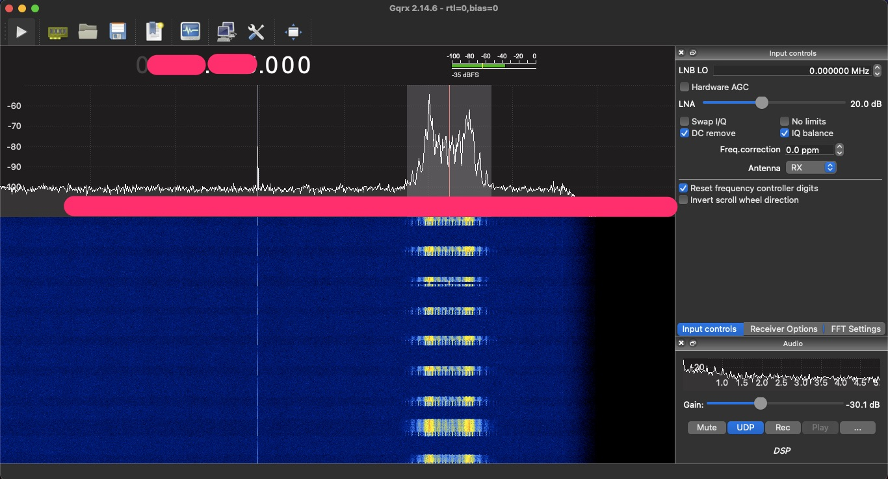

## Viewing sensitive medical information (and birdwatching?) sent through the UK's pager system

The UK [Plans to curtail the NHS use of pagers by the end of 2021](https://www.bbc.co.uk/news/technology-47332415). The reasons given in the article are cost, but in reality the security issue is far, far worse.

I like retro technology and security, but the two very rarely combine in a nice way.

By tuning our radio in to one of the official publicly-documented pager frequencies and piping the audio to a software decoder one can see a full stream of information completely unencrypted.

I shan't go into any details on the hows or wheres as I don't want to make a guide, but it's a simple process requiring about 5 minutes of setup and there's plenty of information already out there.

In about 10 minutes of viewing I saw many ambulance callouts, complete with patients names, addresses and other info, and some mobile phone numbers requesting a call.

Thankfully (and surreally) in between the traumatic messages was a steady stream of birdwatchers reporting sightings. So right after we read about a bad RTC there's a Hawfinch spotted on a pub roof to make us go "aww" instead.. but then there's an organ suddenly ready for donation and all the applications on behalf of hopeful recipients stream through to send us back to depression followed just in time by some Ouzels spotted on a fence!

Honestly I wouldn't recommend viewing the stream, seeing things such as donor recipient requests without getting any closure at all is really harrowing and I don't know how medical professionals deal with this in a psychological sense, but for this post it's enough for us just to know as a concept that this material is out there.

Aside from the ambulance chasing firms probably watching these, or robbers looking for an empty house, it just seems crazy that incredibly sensitive information is broadcast out through plaintext.

I'm not sure what the solution is; Pagers very rarely need their batteries charged and have far more signal coverage than mobile phones which seem to never work in hospitals in particular let alone throughout the expanses of the countryside. I know Tetra's been floated as an option, but even adding some encryption to the devices could be a start.

It's October 2021 now so hopefully these things won't last too long if we trust how forceful the former medical secretary was.

It's fine for birdwatching though! Paging is like a location-less APRS, you can use it for fun and convenience but always with the full knowledge that it's public.
