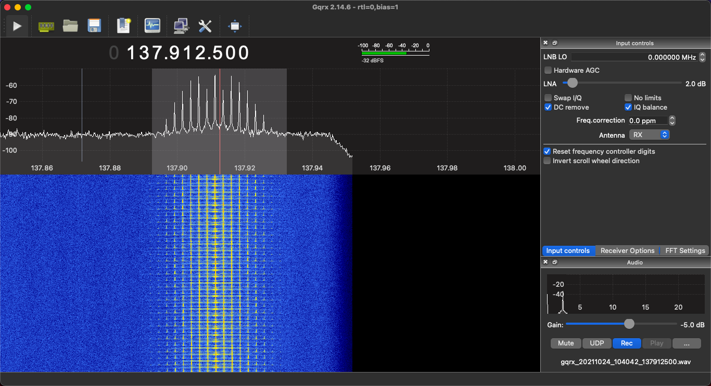

## Expect clouds

In [a previous post]() I created a QFH antenna tuned to the 2M band for better satellite coverage, so I'm going to try it out with the NOAA weather satellites. In summary it works amazingly, from around 6 degrees elevation, with the only dropoff at 9-11 degrees (whether through antenna construction or nearby obstacles I haven't investigated it yet, but it's not important).

In this post I'll detail the steps the work a NOAA satellite on a macbook OSX Big Sur, as most other guides seem to be written for Windows.

### Hardware I used

  * Antenna
  * RTL-SDR v3 dongle
  * Various adapters and cables (eg the pl259 to BNC adapter to plug my antenna in)
  * An LNA (I used a Nooelec SAWbird+ NOAA Barebones)

### Software I used

  * GQRX as my SDR (I always tried out CubicSDR which works just as well, but if you want to use Bias Tee on your RTL-SDR, GQRX seems to do this natively rather than having to download seperate software to activiate it with the RTL-SDR dongle, also GQRX seems to just allow for more minor tweaking). [Available through macports or homebrew](https://gqrx.dk/download)
  * NOAA-APT to decode the wav audio files into an image. Most guides talk about wxtoimg but that option seems dead in the water with OSX now not allowing old 32 bit applications. [I used the OSX compilation option here](https://noaa-apt.mbernardi.com.ar/development.html#compilation)

### Software settings

#### For GQRX
These work for me, but other people find different settings work for them so play around a bit.

**Configure I/O devices:**

_Device String_: when setting up your device, I use `rtl=0,bias=1` do **NOT** use bias=1 if you're not trying to power an LNA through your RTL-SDR.

_Input Rate_: `2560000` (I heard the RTL-SDR can support above this but it can lose data)

_Decimation_: `16` (or 32 if you can get it without cutting off the frequency you want to monitor). This will help block out the UK pager bands which is very close to some of the satellites.

**Input Controls:**

_DC Remove_: ticked

_LNA and Hardware AGC_: Off/set to 0

**Receiver Options:**

_Filter Width_: user (45KHz) this is to account for the Doppler effect, as the signal will migrate slightly to a lower frequency as the satellite completes its overhead pass

_Filter Shape_: Sharp

_Mode_: Narrow FM (Click the ellipses to the right and set Max dev to apt 17KHz and Tau to off)

Then just set the audio output directory for saving your files.

### Capturing images

I don't use any fancy tracking software, just the Look4sat Android app on my phone. I usually aim for satellites hitting over 80 degrees but anything above about 30 is doable depending on your antenna, but obviously the higher the max elevation the better.

Here's the SDR waterfall before we get our signal:

and once the satellite is in position:

Then we just import it to NOAA-APT. I leave my wav file as is without downsampling or anything as NOAA does all that itself.

### Some results

These are the first few images I've had so far, it's almost November so the days are getting shorter and the two or three days I've been trying have been particularly rainy/cloudy over the UK, but the range of the pass is quite good, I think the dark band just below portugal is where my signal briefly cuts out.

I'll keep trying and see if I can get a pass that's both during and day and relatively uncloudy, but my collection of amazing cloud photography is looking promising!

   

    

What's really useful also is the ability to overlay maps:

