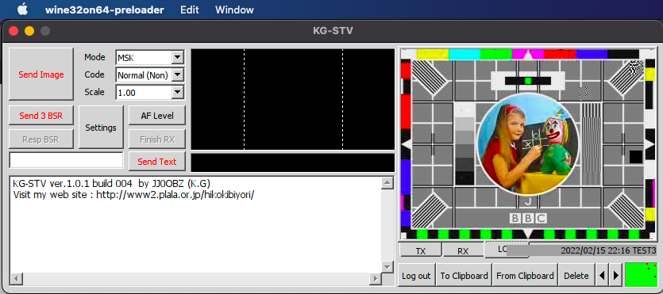
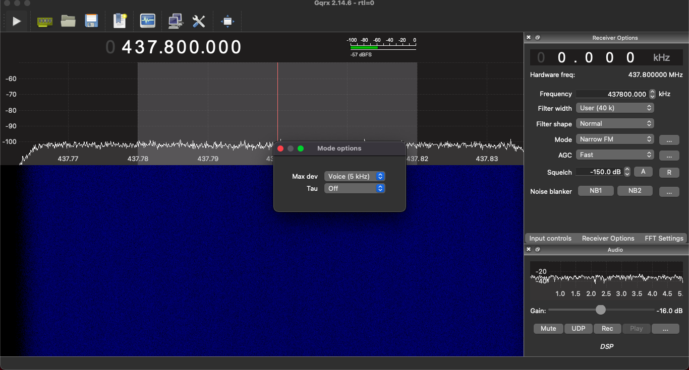
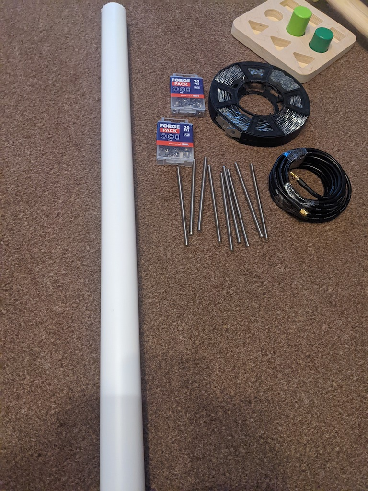
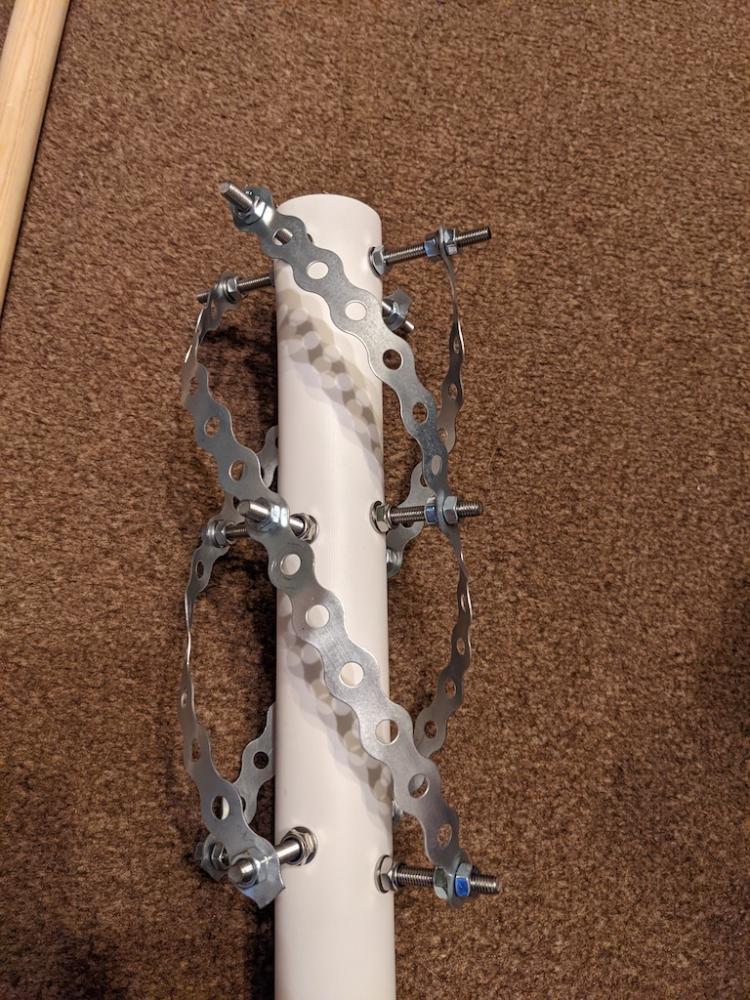
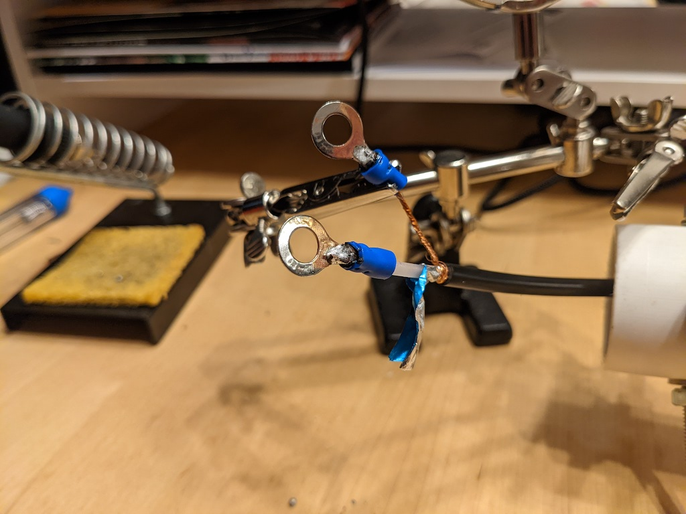
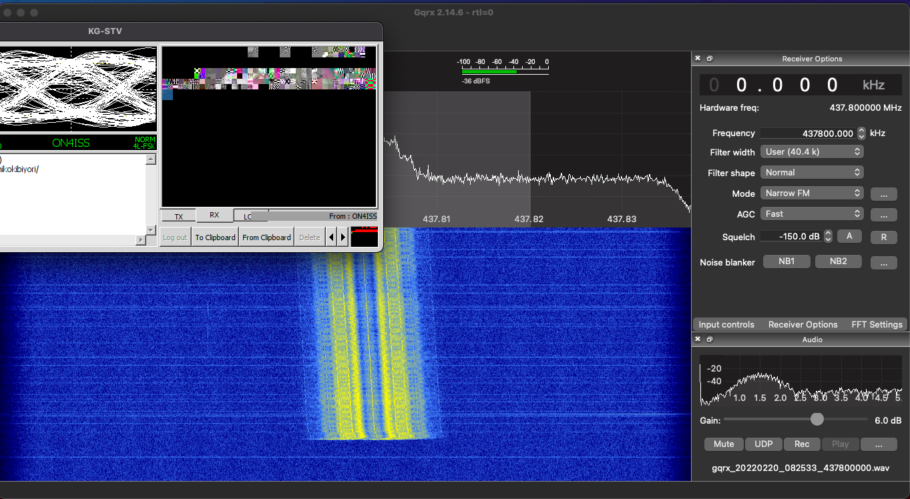
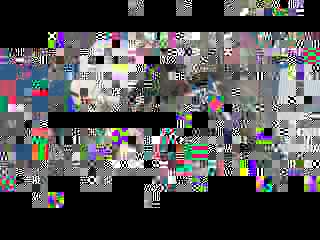
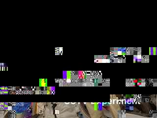

## Receiving an old proprietary SSTV format with short notice

I received [this email](https://amsat-nl.org/?page_id=568) advising on an experiment with a different SSTV mode I'd never heard of via the ISS voice repeater within 5 days.

I didn't open the email itself until very late in the week, so I considered the following issues:

 - This is a proprietary closed-source format; the only program that can open it is for Windows XP/Vista and I'm running a mac with Big Sur, so before any further effort I should check this program will run for me, additionally the developer is Japanese and doc isn't translated very well.
 - I have no antenna for the 70cm band suitable for satellite communications.
 - Even though the event is Europe-based the north of England doesn't get very good elevation during the period in question (max 39 degrees) - nothing I can do about that
 - This uses the voice repeater so the experiment has to compete with people calling CQs into the repeater - nothing I can do about that

# Software

To run KG-STV, I used Wineskin:

```
brew install wineskin-winery
```

and created a new wrapper, telling it to install the kg-stv executable. When I ran this executable set the input source to my virtual audio cable (vbcable) and set my system's default sound output to vbcable, I was able to decode the test mp3:

 [](../images/iss-kgstv/1.png)

With GQRX, I used narrow FM set to voice which works ok on this mode for my purposes:

 [](../images/iss-kgstv/2.png)

# Antenna

I have a QFH antenna I use for 2m when I want to work NOAA satellites or the ISS APRS digipeater, but this experiment instead takes place on the 70cm UHF band, so I have to hurriedly hack together an antenna in a day or so.

I was inspired to use metal banding and threaded rods for my elements by [this original post](https://web.archive.org/web/20210403085430/https://ea4hfv.ga/antennas/QFH.html) now only available via the wayback machine

And [this](https://tf1ez.com/qfh-antenna-build/) more recent implementation.

So quickly I had to run to the shops or online to scrape together the items for the build, I was limited by time so some of the components perhaps weren't quite right, and I opted for an RG58 with pre-soldered SMA contacts so I could just cut one end off and wire it into the antenna.

[](../images/iss-kgstv/3.jpg)

Originally I used the horizontal support struts in the centre like this (out of shot is the balun of wrapped cable):

[](../images/iss-kgstv/4.jpg)         

But during the tuning stage I removed them; it only meant more nuts to undo and reapply and could force the elements into unnatural paths since the holes in the metal banding were around 2cm apart (In the future I'd opt for some banding with the holes closer together for fine-tuning, as it is I still had to drill my own)

I soldered terminals to the end of the coax:

[](../images/iss-kgstv/5.jpg)

And inside the pvc pipe I joined each loop to the one adjacent using a 2-hole piece of the banding bent into a quarter-circle, then attaching the ring terminal to one of the bolts.

[](../images/iss-kgstv/6.jpg)          

[](../images/iss-kgstv/7.jpg)  

In the end the antenna was ready, and as tuned as I had time to do, though the SWR is abysmal at around 3, which I have a feeling is the cheap coax but I can switch that out when I have time after the experiment.

# The experiment              

The KG-STV experiment was confined to 5 passes of the ISS over mainland Europe, at my position in the UK I only had one borderline awful pass at 39 degrees but unfortunately this is when the wind hit 40mph and the rain was heavy, but as a proof of concept the few pixels I got showed the quick setup has some merit.     

Unfortunately also the memo to avoid using the repeater for voice CQs didn't make it out to some people so there was a lot of doubling over 437.8MHz

[](../images/iss-kgstv/7.png)  

[](../images/iss-kgstv/8.jpg)

[](../images/iss-kgstv/9.jpg)


# Next steps

Hopefully ISS SSTV will become more frequent, although I'd prefer them to stick to the usual dedicated frequency rather than use the voice-repeater. Just in case though I'd still like to make some improvements to the 70cm QFH for the future:

- Replace the RG58 coax with better-quality
- Get an LNA that'll work on UHF frequencies to try and boost what signal I do get
- Further tuning on the antenna after the new coax has been fitted to reduce SWR                                   
