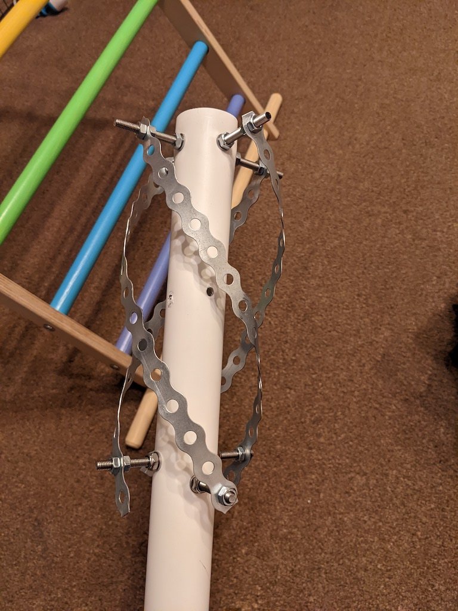
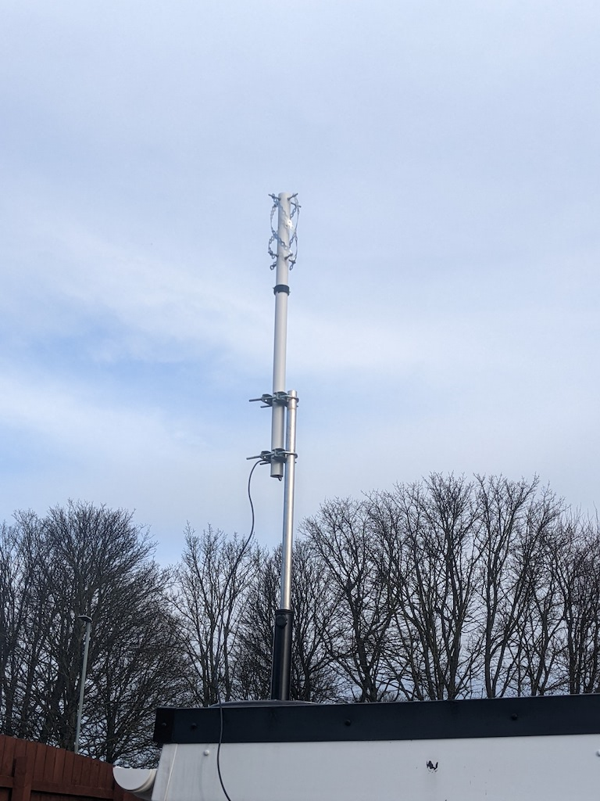

## Receiving an old propietary SSTV format with short notice

I received this email:
 > ARISS Europe to Perform Special Digital SSTV Experiment
February 15, 2022—Amateur Radio on the International Space Station (ARISS) is planning for a special SSTV experiment. ARISS is the group that puts together special amateur radio contacts between students around the globe and crew members with ham radio licenses on the International Space Station (ISS) and develops and operates the amateur radio equipment on ISS.
As part of its ARISS 2.0 initiative, the ARISS International team is expanding its educational and life-long learning opportunities for youth and ham radio operators around the world.  ARISS Slow Scan Television (SSTV), which is the transmission of images from ISS using amateur radio, is a very popular ARISS mode of operation.  To expand ARISS SSTV capabilities, the ARISS Europe and ARISS USA teams plan to perform special SSTV Experiments using a new SSTV digital coding scheme. For the signal reception, the software "KG-STV" is required, as available on internet.
We kindly request that the amateur radio community refrain from the use of the voice repeater thin this SSTV experiment on 20th of February 2022 over Europe.
This is a unique and official ARISS experiment. We kindly request keeping the voice repeater uplink free from other voice transmissions during the experiment time period.  Also note that ARISS is temporarily employing the voice repeater to expedite these experiments and make a more permanent, more expansive SSTV capability fully operational on other downlink frequencies.
The first experiment in the series will utilize ARISS approved ground stations in Europe that will transmit these digital SSTV signals.  These will be available for all in the ISS footprint when SSTV transmissions occur.  The first SSTV experiment is planned for 20 February 2022 between 05:10 UTC and 12:00 UTC for five ISS passes over Europe.  Please be aware that this event depends on ARISS IORS radio availabilities and ISS crew support, so last-minute changes may occur.
To promote quick experimental SSTV investigations—to learn and improve--the ARISS team will employ the ISS Kenwood radio in its cross-band repeater mode.  The crossband repeater operates on a downlink of 437.800 MHz.  Each transmission sequence will consist of 1:40 minute transmission, followed by 1:20 minute pause and will be repeated several times within an ISS pass over Europe.
The used modulation is MSK w/o error correction. For the decoding of the 320 x 240 px image, the software KG-STV is required.  The KG-STV software can be downloaded from the following link: "http://amsat-nl.org/wordpress/wp-content/uploads/2022/02/kgstv_ISS.zip"
The ZIP file contains the KG-STV program, an installation and setup manual, some images and MP3 audio samples for your first tests as well as links for additional technical information about the KG-STV use.
The members of the ham radio community youth and the public are invited to receive and decode these special SSTV signals.
Experiment reports are welcome and should be uploaded to "sstvtest@amsat-on.be" More information will be available on the AMSAT-NL.org web page: "https://amsat-nl.org/?page_id=568"

I didn't open the email itself until very late, so I considered the following issues:

 - This is a propietary closed-source format; the only program that can open it is for Windows XP/Vista and I'm running a mac with Big Sur
 - I have no antenna for the 70cm band suitable for satellite communications
 - Even though the event is europe based the UK doesn't get very good elevation (max 40 degrees) - nothing I can do about that
 - This uses the voice repeater so the experiment has to compete with people calling CQs into the repeater - nothing I can do about that

# Software

To run KG-STV, I used Wineskin:

 ```
 brew install wineskin-winery
 ```

and created a new wrapper, telling it to install the kg-stv executable. When I ran this executable set the input source to my virtual audio cable (vbcable) and set my system's default sound output to vbcable, I was able to decode the test mp3:

 [](../images/iss-kgstv/2.png)

With GQRX, I used narrow FM set to voice which worked ok:

 [](../images/iss-kgstv/1.png)

# Antenna

I have a QFH antenna I use for 2m when I want to work NOAA satellites or the ISS APRS digipeater, but this experiment instead takes place on the 70cm UHF band, so I have to hurriedly hack together an antenna in a day or so.

I was inspired to use metal banding and threaded rods for my elements by [this original post](https://web.archive.org/web/20210403085430/https://ea4hfv.ga/antennas/QFH.html) now only available via the wayback machine

And [This](https://tf1ez.com/qfh-antenna-build/) more recent implementation.

So quickly I had to run to the shops or online to scrape together the items for the build, I was limited by time so some of the components perhaps weren't quite right, and I opted for an RG58 with pre-soldered SMA contacts so I could just cut one end off and wire it into the antenna.

[](../images/iss-kgstv/3.jpg)

Originally I used the horizontal support struts in the centre like this (note also the balun of wrapped cable):

[](../images/iss-kgstv/4.jpg)         

But during the tuning stage I removed them; it only meant more nuts to undo and reapply and could force the elements into unnatural paths since the holes in the metal banding were around 2cm apart (In the future I'd opt for some banding with the holes closer together for fine-tuning, as it is I still had to drill my own)

I soldered terminals to the end of the coax:

[](../images/iss-kgstv/5.jpg)

And inside the pvc pipe I joined each loop to the one adjacent using a 2-hole piece of the banding bent into a quarter-circle, then attaching the ring terminal to one of the bolts.

[](../images/iss-kgstv/6.jpg)          

[](../images/iss-kgstv/7.jpg)  

In the end the antenna was ready, and as tuned as I had time to do, though the SWR is abysmal at around 3, which I have a feeling is the cheap coax but I can switch that out when I have time after the experiment.

# The experiment              

The KG-STV experiment was confined to 5 passes of the ISS over mainland Europe, at my position in the UK I only had one borderline awful pass at 39 degrees but unfortunately this is when the wind hit 40mph and the rain was heavy, but as a proof of concept the few pixels I got showed the quick setup has some merit.     

Unfortunately also the memo to avoid using the repeater for voice CQs didn't make it out to some people so there was a lot of doubling over 437.8MHz

[](../images/iss-kgstv/7.png)  

[](../images/iss-kgstv/8.jpg)

[](../images/iss-kgstv/9.jpg)


# Next steps

Hopefully ISS SSTV will become more frequent, although I'd prefer them to stick to the usual dedicated frequency rather than use the voice-repeater. Just in case though I'd still like to make some improvements to the 70cm QFH for the future:

- Replace the RG58 coax with better-quality
- Get an LNA that'll work on UHF frequencies to try and boost what signal I do get 
- Further tuning on the antenna after the new coax has been fitted to reduce SWR                                   
