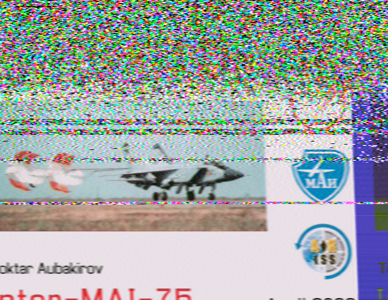

## Trying out different methods of receiving SSTV from the International Space Station

An SSTV experiment by the Russians via the ISS. For the first time since I started playing with SSTV we were outside of winter and the weather was a little more accommodating. The potential passes weren't amazing elevation but they were workable with a max of about 40 degrees twice across two days.

Unfortunately on the first day I couldn't receive a signal and it turned out it was at the ISS end of things so we were down to 1 day remaining with 1 half-decent pass and 2 lower quality passes.

The images came through pretty well, I think my best one as follows was actually on the worst pass received at an elevation of about 13 degrees which shows the difference a rare lack of rain or storms makes!

As you can see the slant correction in the software I use (Multiscan 3B) is pretty abysmal so the image tapers in, but there are no real alternatives on a Mac.

Here are a few more images:

Annoyingly some of the interference on the images were actually people interrupting the experiment by making voice calls over the frequency despite the fact it was announced, as always seems to be the case.

My wife actually had better luck with a cheap Baofeng receiving via a dipole antenna (arm extended to 46cm as a best-guess at the time) connected to a very old smartphone running Robot36, which apparently has far better slant correction available.           

The dipole could only work above around 35 degrees, but the image she received was absolutely amazing, The final result got the most likes I've ever seen on the associated ISS facebook group with a lot of enquiries as to the hacked-together setup.

The whole thing was thrown together about 5 minutes before the experiment so it wasn't elegant and because I couldn't find a cable in time the dipole is just hooked to the radio directly and she looks like a ghostbuster holding a PKE meter!

          

It's now bolted to a camera tripod with a cable connecting it to the radio properly.          

The next experiment was only a few days later and followed a women in space theme, unfortunately we were back to sketchy weather but I look forward to summer SSTV events for once! In the meantime I'd like to figure out some sort of slant correction solution that can (actually) work in unattended mode.

                                    

