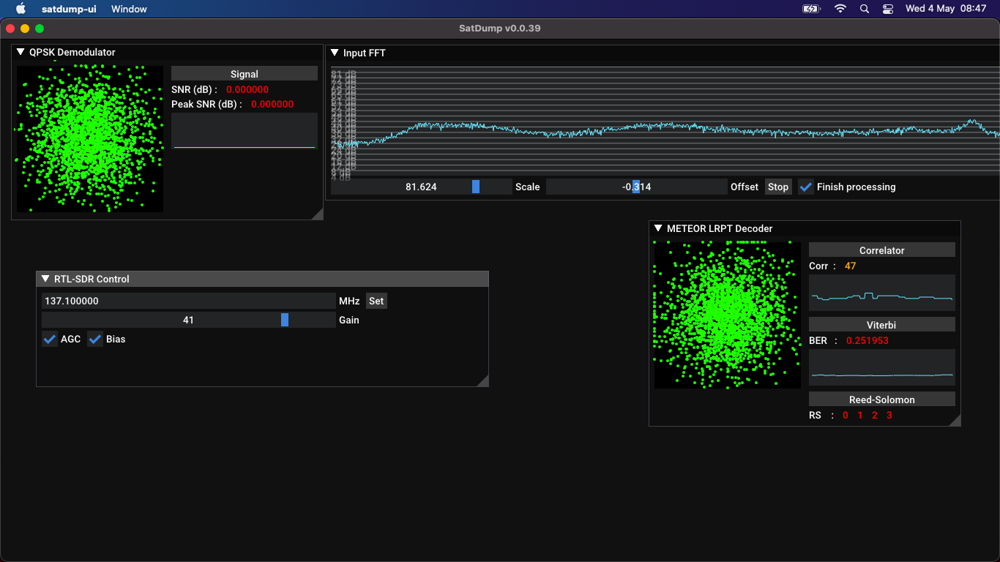
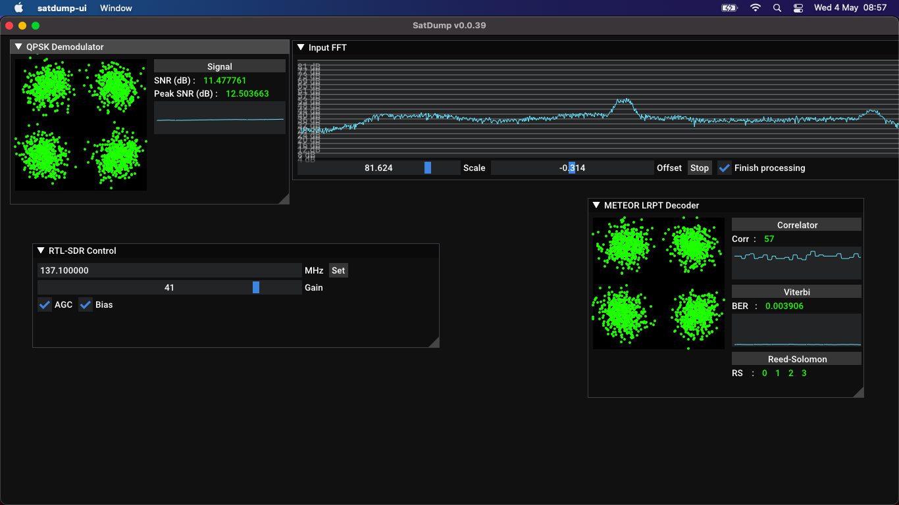
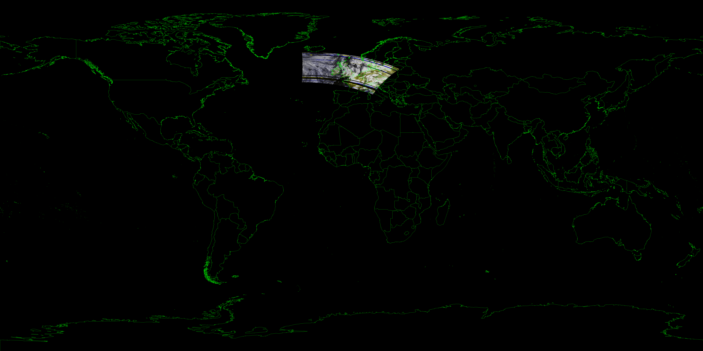

## Receiving Meteor-M2 weather satellite images (And a surprise off-axis image)

It can be quite the disadvantage trying to do anything ham-related on a Mac; Most tools are Windows-only, with Linux getting its fair share now thanks probably to the Raspberry Pi. I thought I was going to be in for a tough time to decode Meteor M2 on my Mac but then I was pointed toward the amazing [Satdump](https://github.com/altillimity/SatDump) which is absolutely amazing beyond my expectations, it makes receiving Meteor M2 even easier than the NOAA satellites!

After compiling and installing the tool I tried it out on a day I knew would be non-ideal; It was very cloudy, raining and there was a storm on the way.

The image still turned out better than I thought. I was using the GUI version of satdump and had it set to live processing, and the amount of images it outputs automatically is so impressive.

Here is the lovely GUI before the signal has been acquired:

And when it has picked up the signal:

  

Here's my favourite from my first pass over the UK:

And one of the other images it outputs is to project the picture onto a globe view which is so cool:

The benefits of it being live processing is that I can leave it unattended for an hour or so while I have to leave the house to take my daughter to nursery and the filesizes aren't greedy at all; usually around 2mb! if I was to try that with NOAA it'd be a few hundred mb at least.

So when I came back on a nicer day I was expecting an image like the one above; looking down on the UK but with a lot less interference. Instead I got this surprise:

A sideways shot showing the horizon!! Now THAT looks impressive!

Meteor M2 is an older satellite and sometimes it can lose altitude control like this and go into a free spin. Its predecessor Meteor M1 sent images just like this before its End-of-life, but M2 has been stabilised by the ground team before although it can take a few days from what I've read and is not without risks.

It's a lovely shot I'm going to want to keep. I might fix that horizontal band but I'll have to learn how to work a graphics program first! Initial attempts at "inpainting" to fill the gap by interpolating the information around it show it can probably be done, I'll just need some (ie a lot of) practice at it:

          
