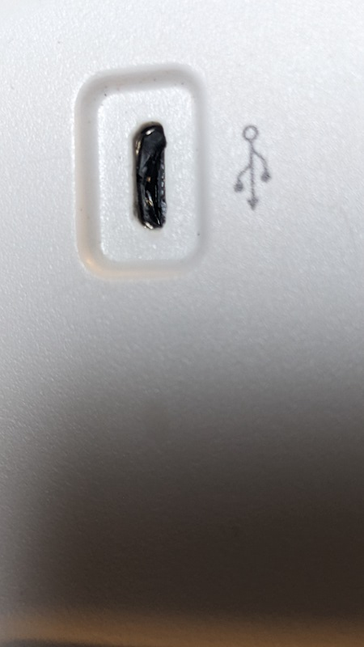
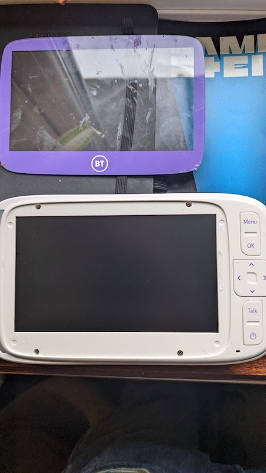
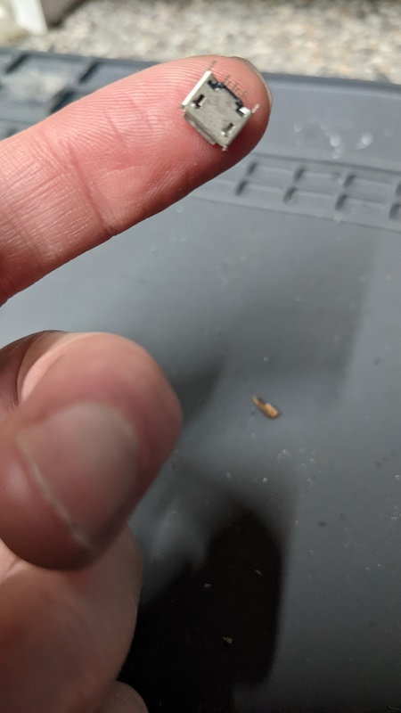
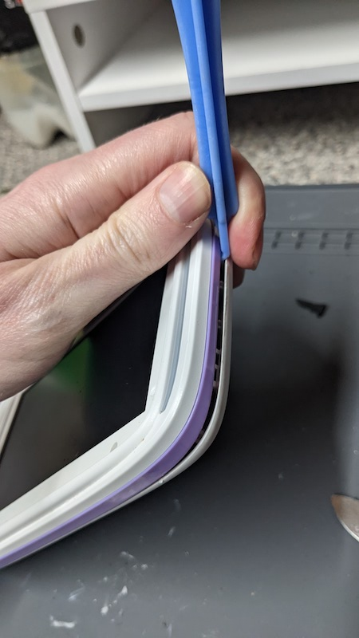
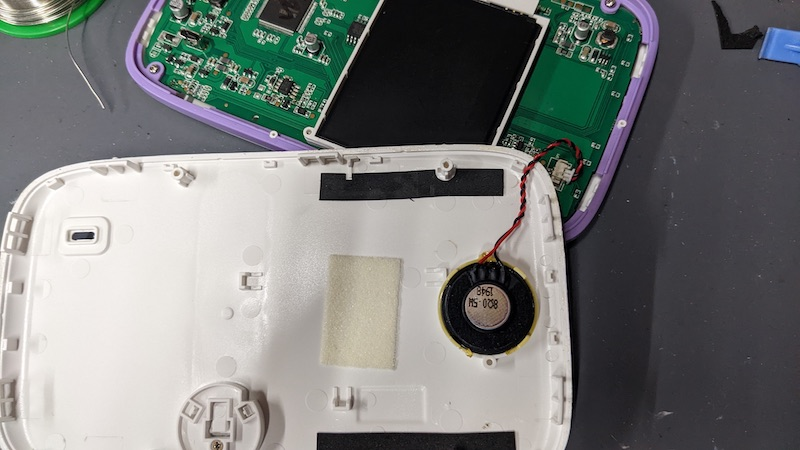
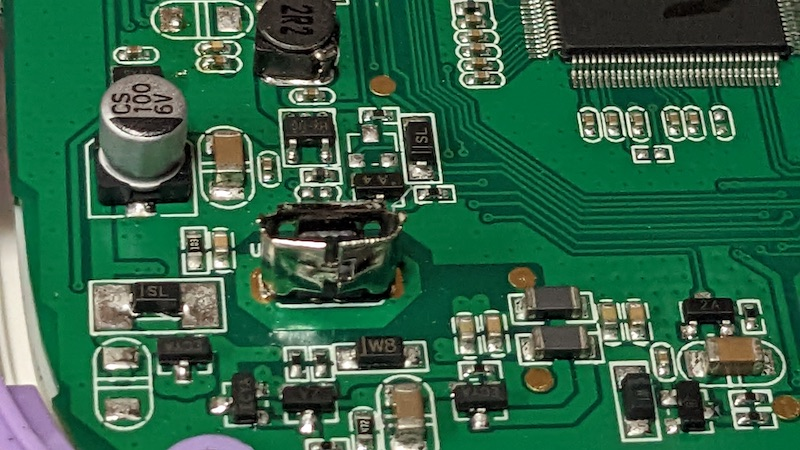
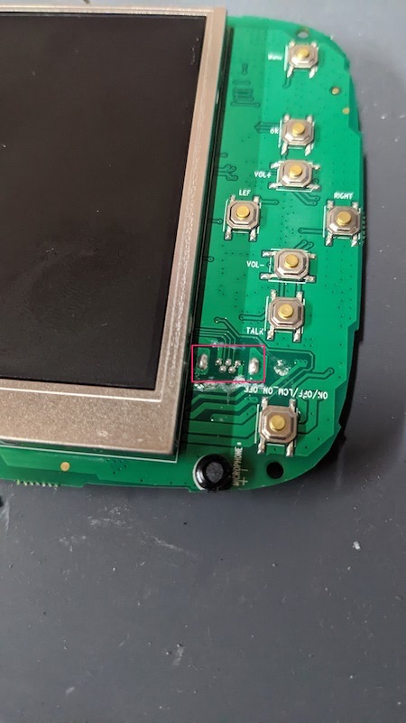
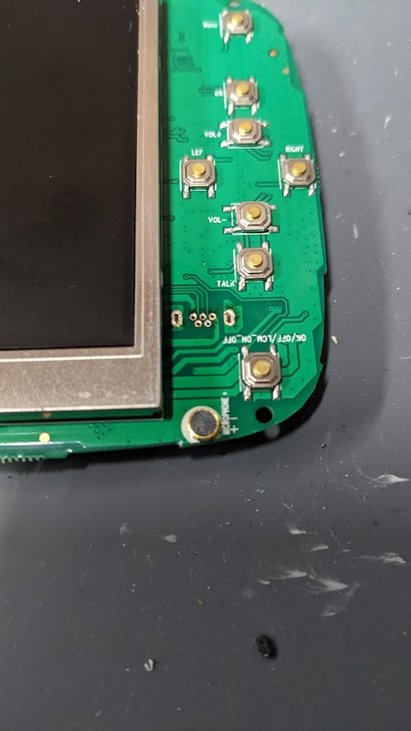
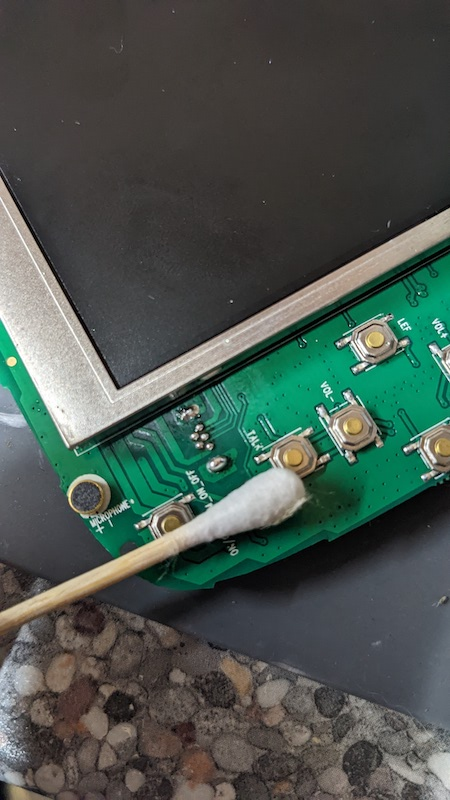
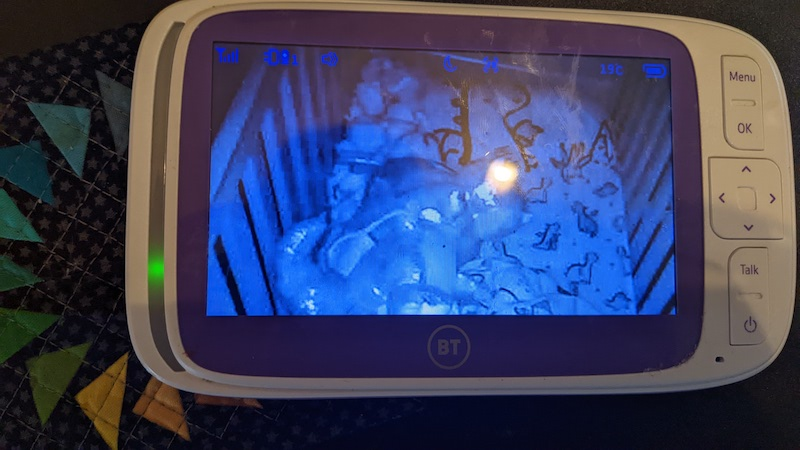

## USB port replacement

# Introduction

I had a month left on my warranty when the baby monitor stopped charging off USB. I contacted John Lewis who said the unit wasn't reparable, and because it was no longer in stock they'd have to replace it with something else.

I didn't like any of the offered units and didn't want a unit going to landfill because of corporate laziness so I declined and decided to risk my warranty by repairing it myself.

The unit is usually between £100-150 and the replacement port to bring it back can be bought for around 50p.

# The repair

As we can see from looking at the back of the unit, the USB port is in bad shape and will need to be replaced:

The screws for the unit are behind the purple fascia at the front, I'd lost my heatgun to a flooding incident but a hairdryer held to the unit for 2 minutes melted the glue enough to easily remove:

The replacement USB port I found on ebay at a price of around £1 for two. It was searchable by just specifically searching for a BT monitor USB port.

The pins on this thing are small!

          

Returning to the unit, once the screws are opened the front and back halves can be very easily pried away from each other. Just be careful as there's a cable inside connecting them so don't yank them apart:

And here's that speaker cable which we unplug:

Now we can further inspect the damage done to the original port through wear and tear:      

     

There are just 4 further screws to undo and we can lift out the mainboard and see where it is soldered:

  

I used a desoldering braid to remove the existing solder and then cleaned the traces with alcohol after the original port had been lifted out. In my head I was already budgeting for a new baby monitor:

   

And then we fit the new port. The contact pads and distance between the pins is so tiny I just brought the soldering wire to the traces and pins and removed it immediately, being very sparing at applying it as it takes a lot less than you'd think.

The details are so minute I had to inspect it afterwards with a loupe to ensure that I hadn't caused a short-circuit across the pins anywhere:

              

The glue from the fascia remains very tacky and more than enough to secure it back onto the unit, though it'd only be a cosmetic issue if I had to bin it anyway.

And now for the moment of truth, the monitor is once again charged and back to life!

                             
