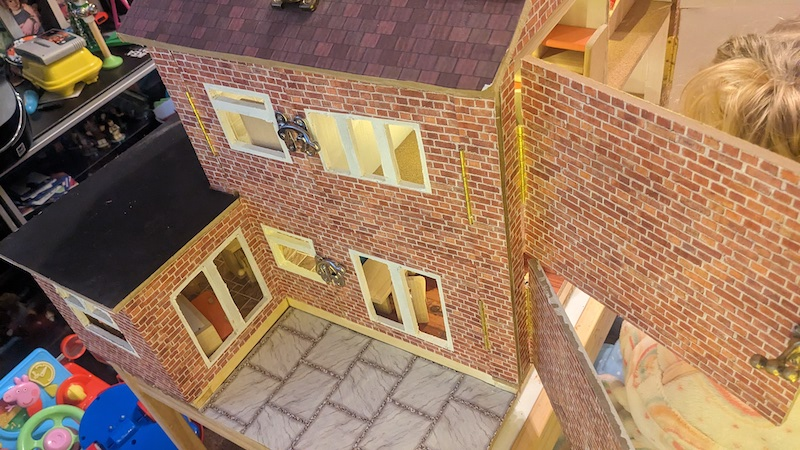

## And now for something completely different

           

# Introduction

I've no woodworking experience, but decided to build a dollhouse replica of my real house anyway as a present for my daughter. Because it's a replica of a real house (ie 3-dimensional rather than front-access only and 1 room deep) and despite no knowledge of either woodworking or dollhouses I had to make up my own designs and come up with my own solutions to doing things to accommodate this.

Should I pick a more simple beginner project? Yes! Did I? No.

The overall project took around 2 months. A lot of this time is waiting for coats of paint or wood glue to dry (Which isn't very quick outdoors in winter) so a lot of the steps here are done in parallel, but I'll present them as if they were done one at a time.

# Considerations

With regards to the dollhouse, I eventually settled on a 1:18 scale (1:12 would've been fine but for a kitchen extension which would've made the overall depth of the house huge and would've meant it couldn't get out of the shed door).

I also decided not to include such details/fixtures and fittings as windowsills, fascias etc as the house will be for my daughter's 2nd birthday. Therefore durability against being hit or landed on will be a primary design concern. The core strength of the house will need to withstand an unstable child falling on it or using it for support. For lighting I will be using hidden batteries rather than a mains supply.

As for my blog post, as I said I've never done woodwork before, it's all new to me so this post will probably be very long and very comprehensive; a lot will be obvious to people but one or two may find it helpful. This build will be split across several posts, you can view them all by clicking "Archive" above.

# Skeleton frame

I decided to use an skeleton frame and build off that, as each corner will need to support two hinges and allow both doors opening out to the same corner without colliding. I used 20mmx20mm pine batten for this.

First I laid out the ground floor footprint flat to check it was cut to size.

      

To connect the corners I simply cut a half-lap joint

       

          

And to connect the pieces where they cross each other I used a full lap joint. To cut this I just cut a few lines in with a hacksaw, easily pried the bits out with a screwdriver then sanded down:

                                   

          

Then it was a case of laying them all together and clamping them together after applying wood glue.

  

                

I then did the vertical part of this and had it all ready but didn't bond them together yet, for illustration purposes (and to test the measurements and cut) they're just balancing here.  

     

[Next page: Ground floor]()                        
