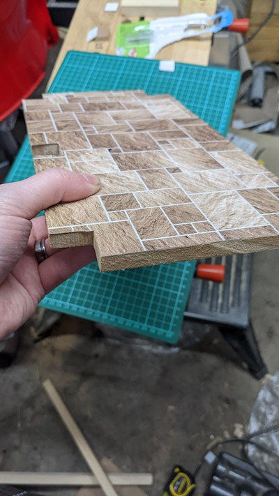
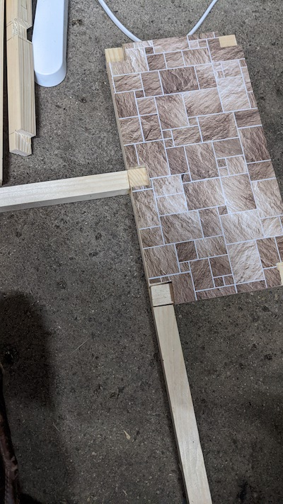
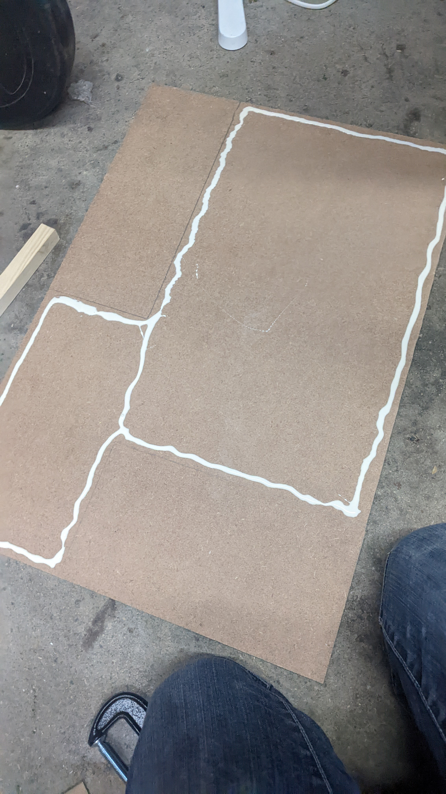

## Ground floor

# Ground floor, its internal walls and house footprint

In our last post we showed the basic skeleton frame being prepared, so now we're going to measure and cut some 9mm MDF for the kitchen extension floor first:

  

And then we'll cut some tile-patterned vinyl to match:

   

                              

And then we'll do the same with the living room and dining room:

        

     

Now let's attached the vertical components of the skeleton to the base level we bonded earlier. Here we attach them with wood glue with corner clamps keeping them in place then put a screw up through the bottom

     

                    

Now once that's dry we cut a rectangular footprint for the whole houst in 9mm MDF. This will support the entire structure when it is carried, as I wanted to be sure the weight was distributed evenly and that there wasn't stress on the frame attaching the kitchen extension to the side.          

Here we add woodglue

    

And then clamp it down:

                    

As before, we also put screws through. To be extra safe (Considering we're screwing into MDF) I drilled a pilot hole then a countersunk hole for each screw.

The pilot hole is the same width as the central shaft of the screw so that only the threads of the screw are actually being "forced" in by the screwdriver, to find the correct size drillbit we just hold it in front of the screw, it will match the shaft width and leaving the threads visible. I will do this for all screwing from here onwards.

Then we countersink it by doing a shallow dit of drilling with a larger drillbit which will accommodate the head of the screw, this will allow it to sit flush with the wood:

  

        

Now let's get started with the internals. First we cut some rectangular doors and paint. (For all painting I will do I spray the MDF with primer and then paint with acrylic paint)       

        

I took a few photographs of pictures hanging on our wall, printed these to 1:18 scaled and then glued them to some wood. These will make the room recognisable to a child.    

   

For the internal walls, I cut more MDF (only 6mm thick for vertical walls as they won't be danced on by dolls) and attached them together at 90 degrees. Where they meet I put a wooden block in. This block will be a supporting internal pillar to support the centre of the ceiling/first floor to the base and can be as thick as the hallway allows, which I won't be making an accessible part of the house:

         

Where I screw these walls to the wooden block support, i cover the screw with the internal doors:

  

And now we affix the ground floor surfaces then glue down the internal walls. They will be further attached by gluing down that wooden block with a few screws up into it from the base footprint:

  

                                          
