## Repairing a Twirlywoos big red boat

# Fixing sound, lights and fruit tea machine button

This is a pretty cool toy from a TV show my daughter's into, but they're not sold new anymore. When buying second hand many seem to be affected by the same issues, these are fairly easily fixed and means you can pay sometimes less than half the normal asking price and bring it back up to scratch yourself.

My boat had one working light, and the button to empty the fruit tea machine was missing. I hoped it was just pushed in too far and could be put back. When the boat arrived it immediately gave a reassuring rattle letting me know that that button was still likely inside the main body.

Firstly, we'll want to open it. Unscrew the screws at the bottom from underneath. This won't let the base separate just yet; eventually I found out that first we must remove the wheels to get access to the screws hidden under the wheels. This arduous task is the biggest challenge we'll face today! I wrapped my handkerchief round the wheel, twisting and pulling that wheel while I held the other still until one came free (It doesn't matter which comes off).

[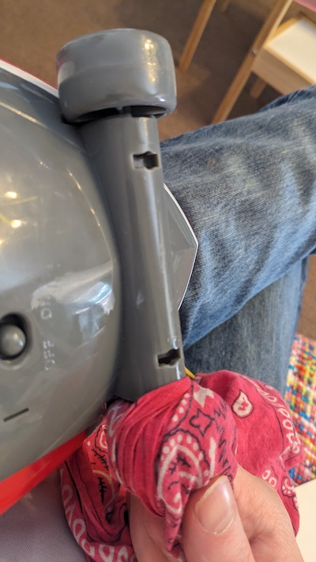](../images/bigredboat/1.jpg)  

And here you can see one of those annoying screws:

[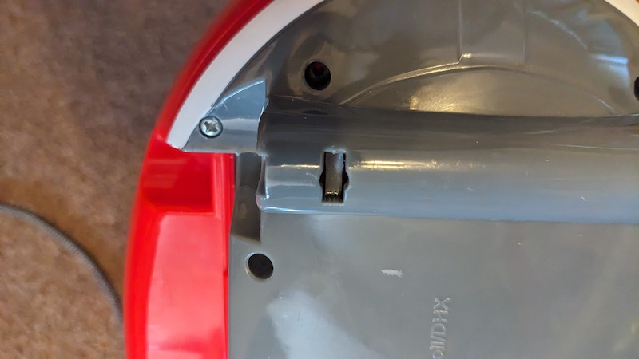](../images/bigredboat/2.jpg)  

(When we're all finished it's up to you whether you replace the screws back under these wheels, I left them out so that access will be easier and quicker if I need to open it again in the future)

Here is what we see when the base is removed:

[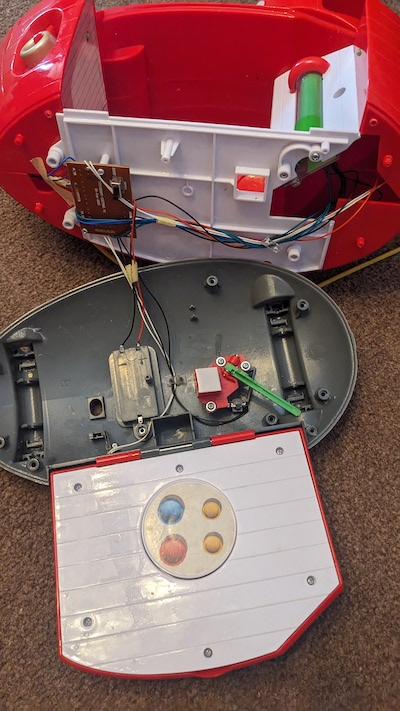](../images/bigredboat/3.jpg)      

This green lever is what sits behind that red fruit tea machine button we want to put in:

[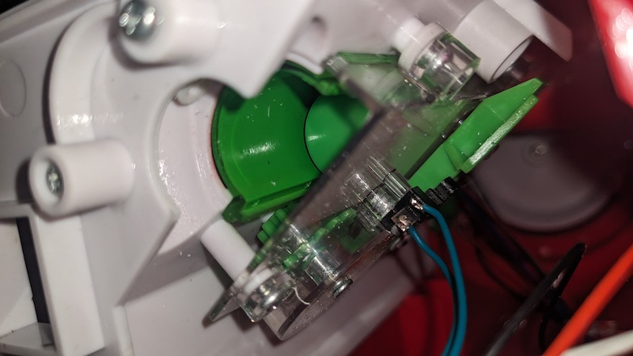](../images/bigredboat/4_1.jpg)  

We simply unscrew the mechanism that lever is attached to, slot in the button and screw it back on, very easy:

[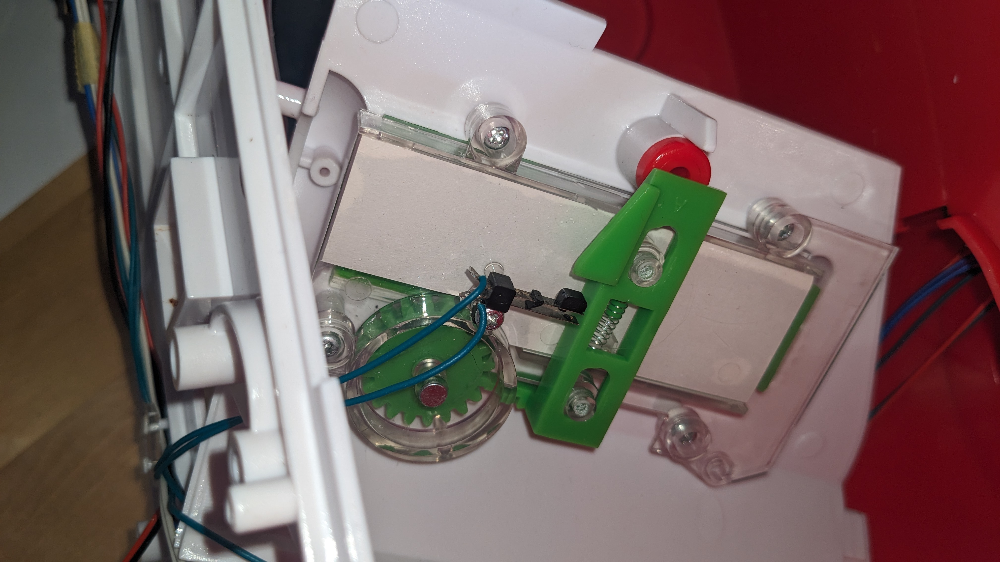](../images/bigredboat/4.jpg)            

Now we'll move onto the lights and sound. The speaker is at the bottom rear near the fruit tea machine so it's easy to reflow with solder if required. To get at an LED we will have to dismantle the upper body of the boat, so we start by removing the guard securing the speaker to both halves:

[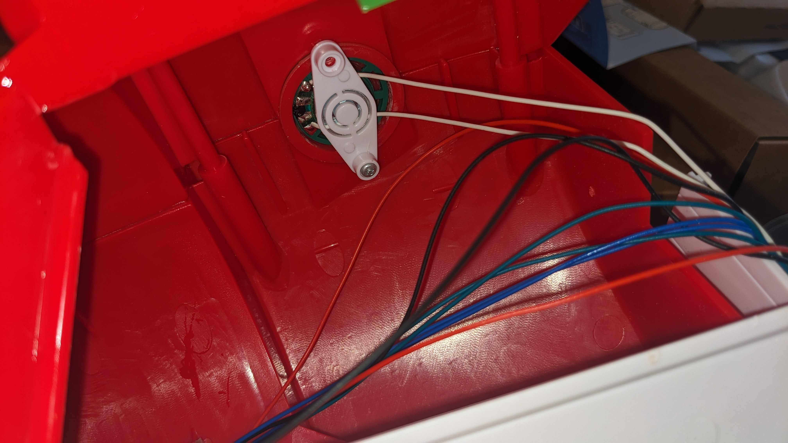](../images/bigredboat/5.jpg)     

And then we just remove all the screws from the side of the boat from the outside so both halves come apart (For this you will need a long precision driver). Once I did this you can see the black wire at the top of the picture that isn't connected to anything:

[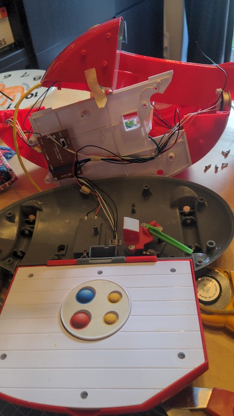](../images/bigredboat/6.jpeg)

When we inspect the LED itself, we can see where this wire should go, and also why it's a fairly common issue among these boats if they're getting knocked about, it'll stress this joint:

[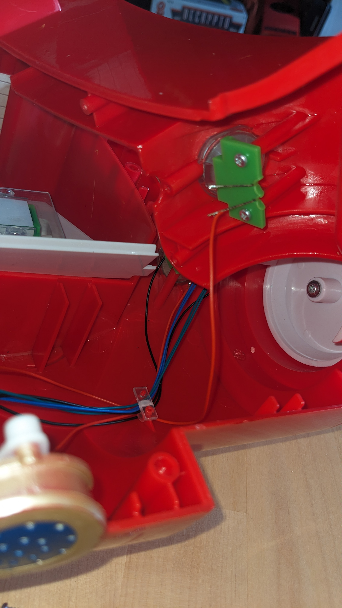](../images/bigredboat/7.jpg)                               

Now when we've resoldered that and tested that everything works, we can put it all back together! (First I wrapped some insulating tape around all of the LED legs as a bit of futureproofing, just so that if the wire flexes due to excessive movement it doesn't stress the soldered joint)

Place the twirlywoo character tumbler at the top and turn it, sure that the right character name is said with each turn. Next you can put the upper body halves back together and re-fasten the speaker guard. Then bring the upper body back to the base, raising this green track to slot into the fruit tea machine:

[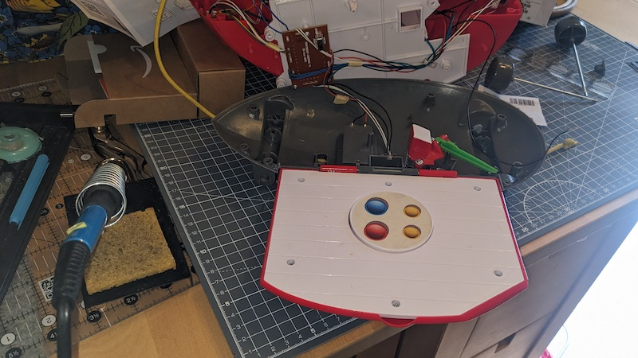](../images/bigredboat/8_2.jpg)  

[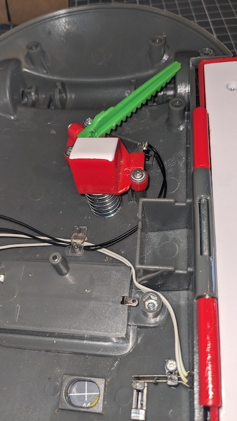](../images/bigredboat/8_1.jpg)   

And here we have it, everything is all working like new!

[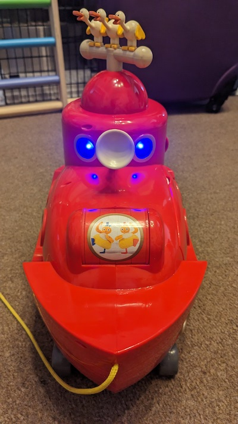](../images/bigredboat/8.jpg)                    

Now my daughter absolutely loves the lights and sounds and acts out scenes from the show with her toy as they happen!          
