## Ground floor ceiling and lights

# A parallel lighting system using copper tape

Hello again my friends! and welcome to that most extreme example of manliness, that is to say wholesome activities for adults that will entertain and inspire your children, lovely!

So as I said in a previous post, Most things I did were done in parallel. As the various primers and glues and paints in the past 2 posts were drying or being primed and glued and painted I was also learning how to cut windows and doors using a jigsaw.

After drawing the shape I wanted I drilled two holes for each rectangle, then jigsawed out between them all and file that down:

  

Then I primed and painted the inside with acrylic paint (The type of paint I used everywhere in this project)

[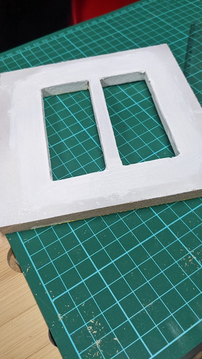](../images/dollhouse/33.jpg)            

and trace the outside onto some patterned paper, cut out with a bit of slack to let some more white paint through to show the PVC frames (As above, under the paper the wall would look like batman's eyes under his cowl. It's a primed wooden surface with a mess of white acrylic paint sloshed about where the windows will be). The patterned paper as attached below is glued using children's PVA craft glue:          

[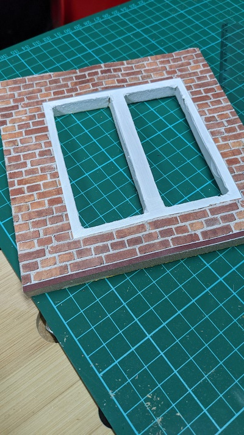](../images/dollhouse/34.jpg)  

I showed the window here because obviously there will one a window for every room, but some walls will be a simple rectangle with the patterned paper over and no holes jigsawed. Then we glue them all into place:

[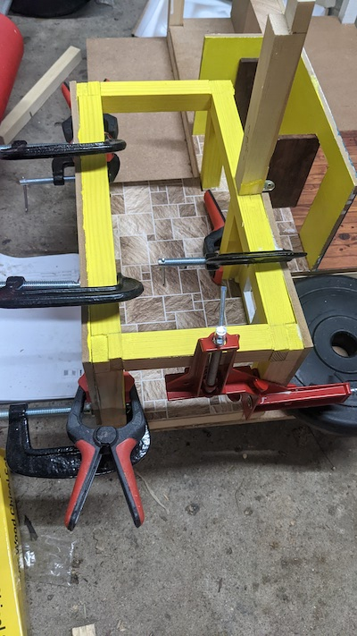](../images/dollhouse/35.jpg)

# Electrics

Now this was another area I found I was very much playing solo against most other modeller-style dollhouse builders. This is for good reason; properly professional and hobbyist dollhouses may be so intricate as to not be geared toward young children and so their lighting is mains powered. I wanted to avoid mains for reasons of safety and portability so I just made a battery-operated solution. I counted the number of rooms I wanted to light, chose a bulb and its voltage (12v, warm yellow light), these I chose to wire in PARALLEL. I chose parallel so if any bulb ever got damaged etc the rest would still work. Also all would fade at the same time. These could easily be powered by 8 x 1.5v batteries.

I chose the old project lamp sockets you've all ued in primary school, drilling an extra hole for wires to go out the back:

[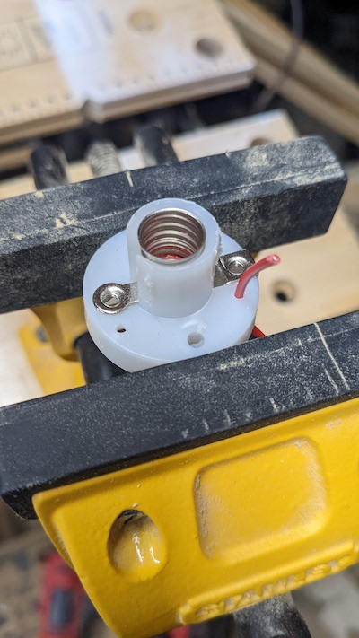](../images/dollhouse/36.jpg)         

And then after priming and painting the ceiling I attached these on:

[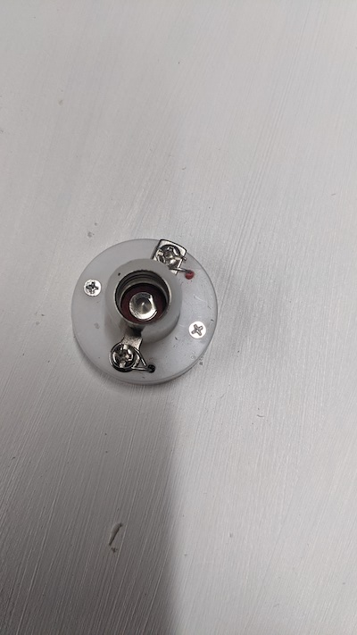](../images/dollhouse/37.jpg)               

[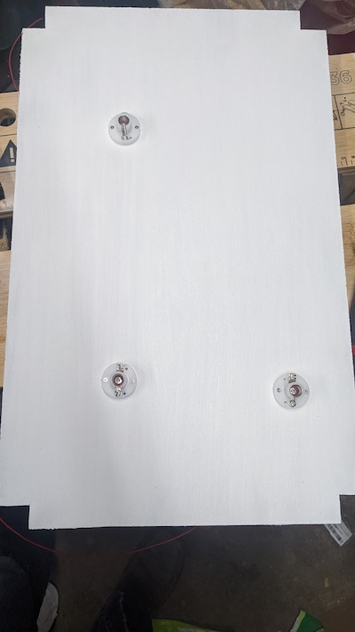](../images/dollhouse/38.jpg)       

I placed the above by pencilling out the room dimensions above it so each lamp was in the middle of the room below.

I screwed some brackets into the pillars that the ceiling would fit into:

[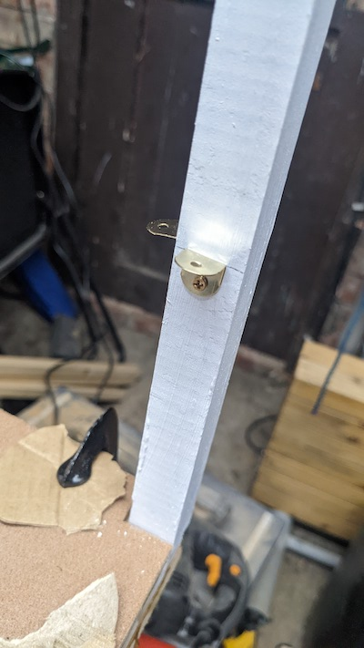](../images/dollhouse/39.jpg)   

Now to wire it up. I first tried wires (Don't do this, I'm only showing to explain why it's bad)                 

[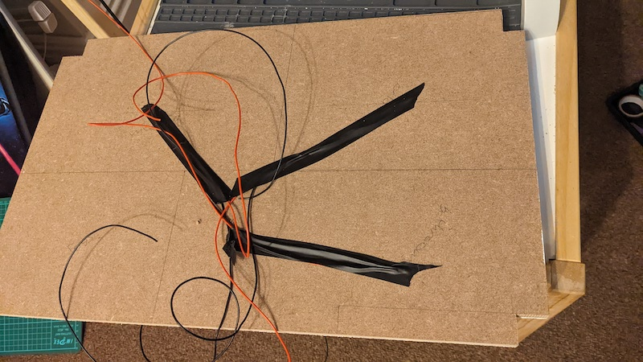](../images/dollhouse/40.jpg)       

When samples of the carpets of the floor above were laid it was truly awful. I have loads of copper tape (usually used to keep snails off the rims of plant pots, but I've used them in previous blog posts for repairing traces when re-capping old consoles). basically all that means is that you replace 3d bulky wires with nice smooth coppers tape:

[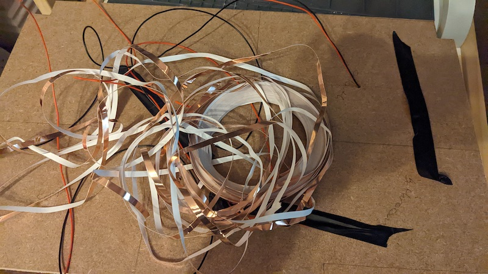](../images/dollhouse/41.jpg)        

[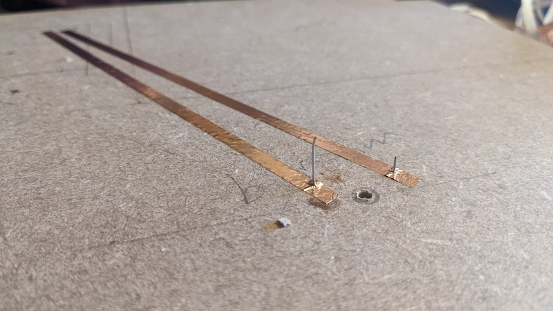](../images/dollhouse/42.jpg)         

[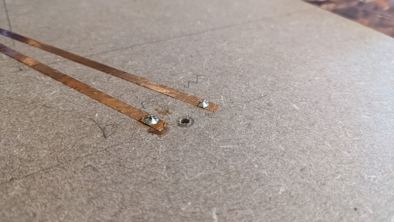](../images/dollhouse/43.jpg)        

[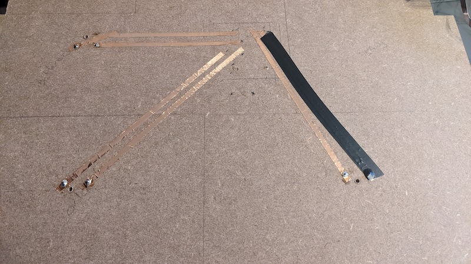](../images/dollhouse/44.jpg)     

As you can see above, what I'm doing is marking the end of each track with positive or negative, as the 'D' in 'LED' means "Diode", ie it'll only work if the positive and negative are connected to the right places. All of these tracks end in one section; the place where the upstairs hallway will be (so, another area I won't actually make playable, so I can run wires up there)

Now since This unplayable hallway will be bounded by a ceiling above, a floor below and walls all around I anticipate that it will be difficult to access. Therefore I hot-glued the wires down (that will feed to the first floor) against their connections just to add some extra resilience:

[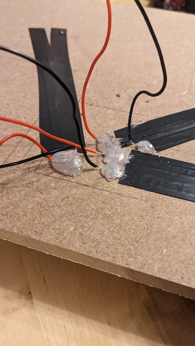](../images/dollhouse/45.jpg)  

Obiouvly we connect 8 X 1.5v batteries to these wires and check each light comes on. But, just because we're vain, let's put this ceiling onto those brackets and add some furniture to get a taste of how it'll look. (Here we can see some gaps between the ceiling and the walls, but the ceiling will be drilled down into the pillar support that we introduced last post)

[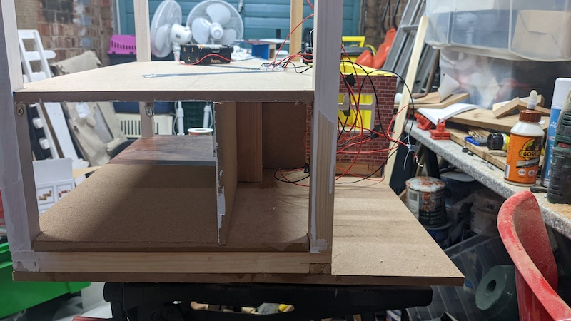](../images/dollhouse/46.jpg)   

[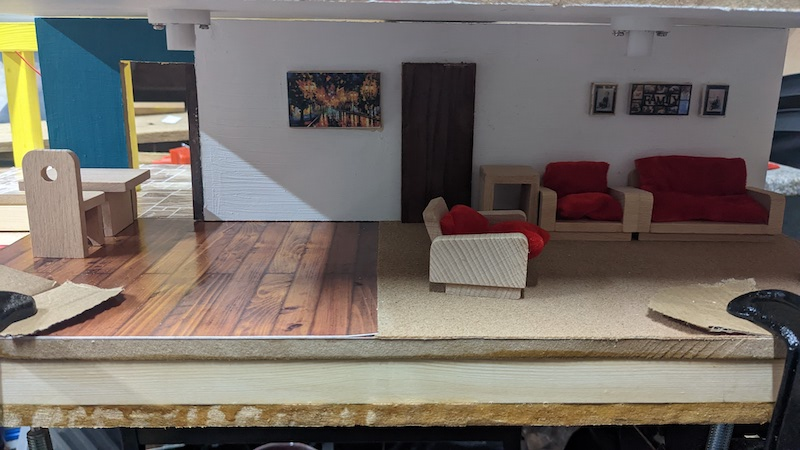](../images/dollhouse/47.jpg)                     
