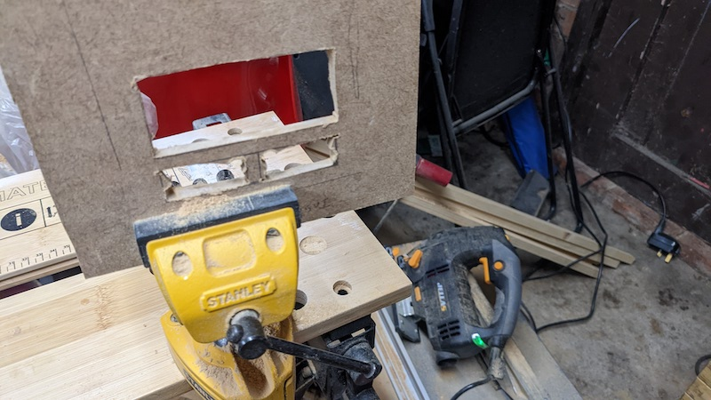

## Ground floor ceiling and lights

# A parallel lighting syste using copper tape

Hello again my friends! and welcome to that most extreme example of manliness, that is to say wholesome activities for adults that will entertain and inspire your children, lovely!

So as I said in a previous post, Most things I did were done in parallel. As the various primers and glues and paints in the past 2 posts were drying or being primed and glued and painted I was also learning how to cut windows and doors using a jigsaw.

After drawing the shape I wanted I drilled two holes for each rectangle, then jigsawed out between them all and file that down:

  

Then I primed and painted the inside with acrylic paint (The type of paint I used everywhere in this project)

            

and trace the outside onto some patterned paper, cut out with a bit of slack to let some more white paint through to show the PVC frames (Under this paper the wall would look like batman's eyes under his cowl, ie a plain wooden surface with a mess of white paint)          

  

I showed the window here because obviously there will one a window for every room, but some walls will be a simple rectangle with the patterned paper over and no holes jigsawed. then we glue them all into place:

# Electrics

Now this was another area I found I was very playing playing solo with among everyone else who ever made a dollhouse. Properly-professional and hobbyist dollhouses may be so intricate as to not be geared toward young children and so their lighting is main's powered. I wanted to avoid mains for reasons of safety and potability so I just made a battery-operated solution. I counted the number of rooms I wanted to light, chose a bulb and its voltage (12v, warm yellow light), these I chose to wire in PARALLEL. I chose parallel so if any bulb ever got damaged etc the rest would still work. Also all would fade at the same time. These could easily be powered by 8 x 1.5v batteries.

I chose the old project lamp sockets you've all ued in primary school, drilling an extra hole for wires to go out the back:

         

And then after priming and painting the ceiling I attached these on:

               

       

I placed the above by pencilling out the room dimensions above it so each lamp was in the middle of the room below.

I screwed some brackets into the pillars that the ceiling would fit into:

   

Now to wire it up. I first tried wires (Don't do this, I'm only showing to explain why it's bad)                 

       

When samples of the carpets of the floor above were laid it was truly awful. I have loads of copper tape (usually used to keep snails off the rims of plant pots, but Ive used them in previous blog posts for repairing traces when re-capping old consoles). basically all that means is that you replace 3d bulky wires with nice smooth coppers tape:

        

         

        

     

As you can see above, what I'm doing is                                                                 
