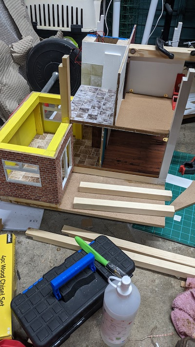
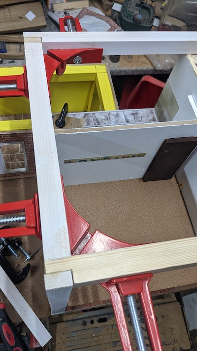
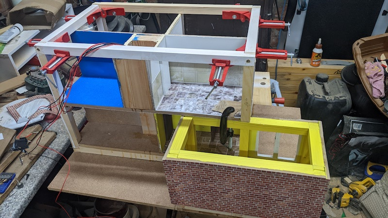
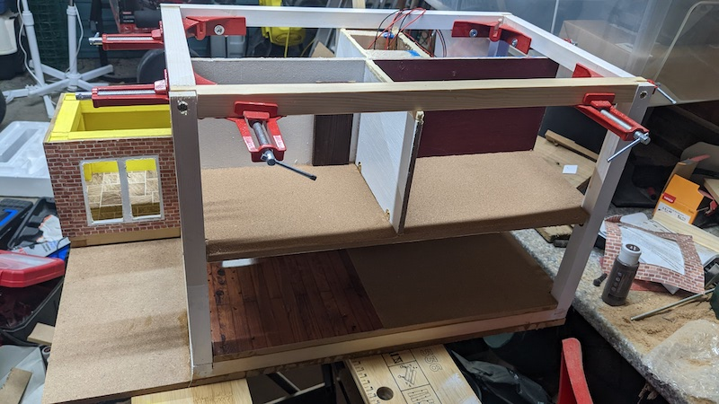
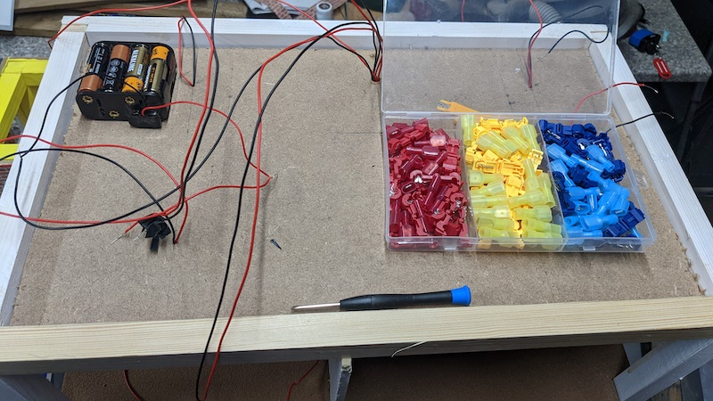
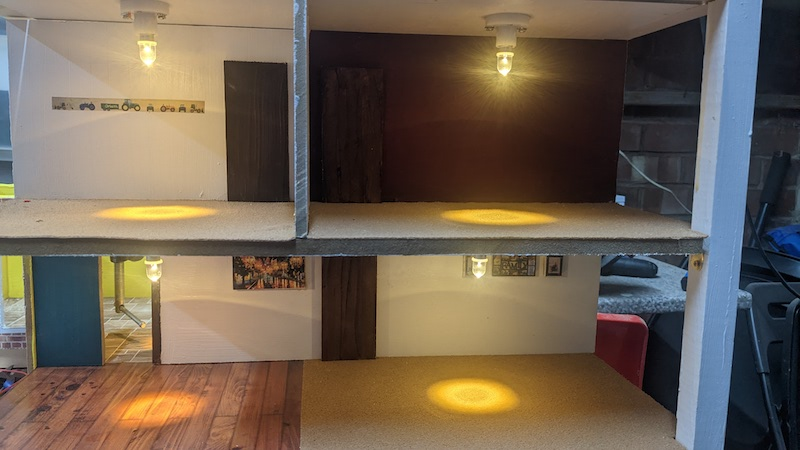
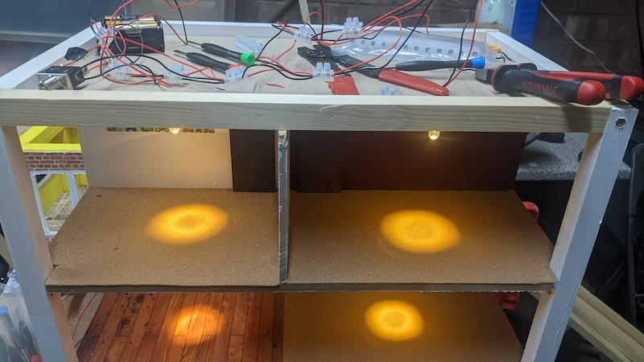
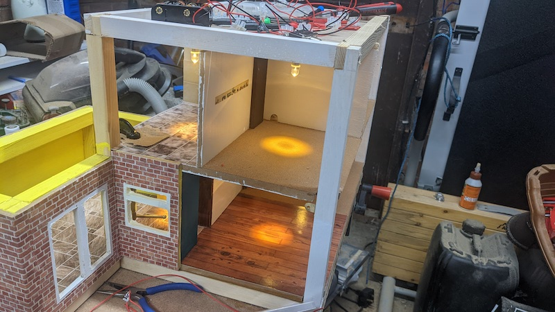
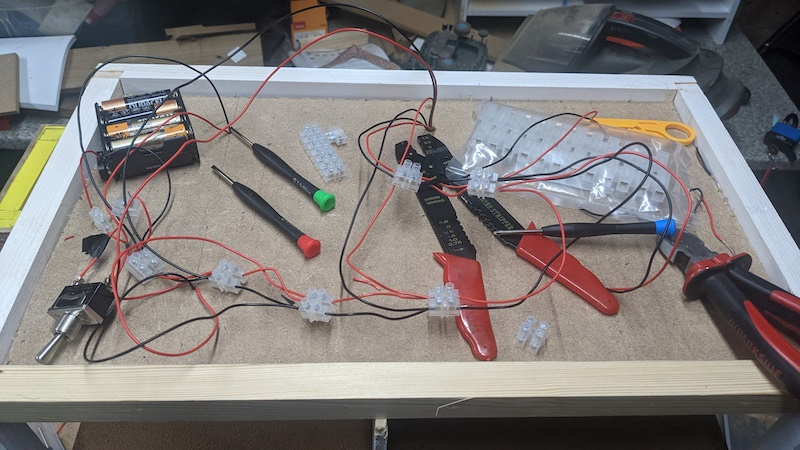
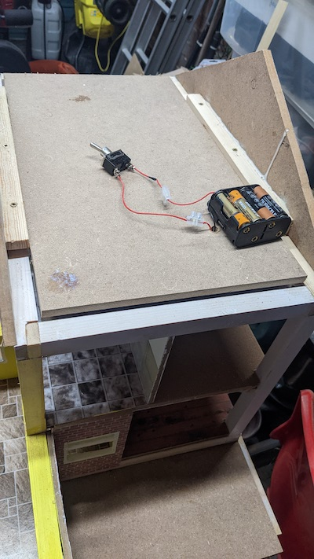

## 1st floor and electrics

# Upstairs rooms, electrics and hooking it all up

I'll spare a guide of the interior of the upstairs as it's pretty much the same process as the downstairs; the interior walls are connected to a solid block which will double to provide vertical support. These are then screwed to the floor (The ground floor ceiling we covered in the previous post). I did steal some room from the upstairs hallway to make the bathroom more spacious so things like model baths and showers etc can fit in easier. It also has a gap to feed the wires from the downstairs lights further upwards into what will eventually be the attic:

  

Next I've topped the house's inner structure with its horizontal supports:

Now we make a ceiling for this floor (no circuit tracks needed this time; the cables from the first floor rooms feed directly upwards with a hole to feed in the ground floor wires):

Now we connect all the wires into one circuit using some cable connectors and hook these up to a switch and battery pack for testing:

And then we put an attic floor in, with a hole for the switch and the battery pack. This keeps the rest of the wires hidden away from little hands, as the batteries and switch are the only part we will regularly need to access:

