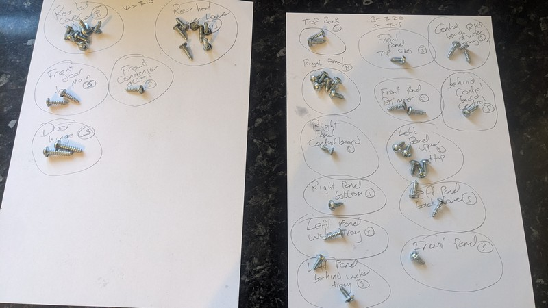
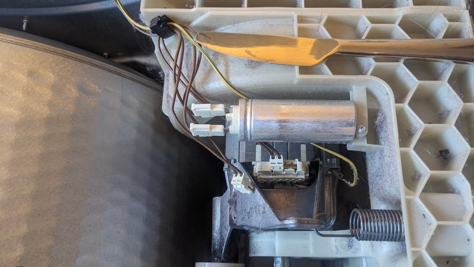

## 4 beeps error code for control board and a broken drive belt

# The issue

The tumble dryer was working fine until a sudden chaos which sounded like some keys were rattling around inside it or something, then it stopped working and every time we tried to start it after that there were 4 beeps and 3 lights lit.

 A web search showed this to be a control board issue, so the first step was to open the top panel and check for any loose wiring, but inside I found a completely snapped drive belt. The dryer is 12 years old so this is toward the end of the belt's expected lifetime:

Because the error beeps indicate a control board issue or possible loose wires, I'm working on the theory that the railing was the belt flailing around inside and knocking off wire terminals.

The replacement belt only cost £11 (Model 9000431719) so there's nothing to lose by trying to fix the dryer before resorting to replacing it.

# The fix

When working on this dryer, we are going to need star-shaped screwdriver heads of T-10, T-15 and T-20 and preferably an electric screwdriver that can fit them (as there are a LOT of screws), and a longer compatible socket screwdriver to reach the screws behind the water container as you pull it out (for a condenser model as this is). I also used a right-angled ratchet screwdriver to open the cover above the blower.

The first thing to do is to find some way of organising your screws, because there are a lot and there's a few different shapes and sizes. Here's what I used:

Then what I did was open the top and side panels. It's possible that it may be easier to get the belt over the drum through the back but I found it easy enough to do via the front without removing everything there as that's where all the fiddly bits are.

(Every problem's an excuse for teaching life skills!)

Just beside where the belt is driven I found a loose cable, which is probably the source of the control panel failure, so that was unexpectedly easy and proved my initial theory correct:

       

So now to change the belt. The first thing is to get it around the drum, flat side facing outwards.

I undid enough screws at the front until I could push the drum back and leave about a half-inch gap between the drum and the front cover, and just fed the belt around through this as I rotated the drum by hand a bit to help:

        

After that we have to remove the blower cover at the bottom of the right hand side (As you face the machine from the front).

Some people may need to remove the entire front cover to do this, but if you're blessed with smaller hands then you can release the catches behind the cover and use a right-angled ratchet screwdriver to remove the single screw to the back right as you face the cover.

                             

Next we have to get it over that fan, I was able to get it over the fan without removing the fan itself, but if needs be it can be removed with a ratchet.          

You can see the treads of the bolt behind the fan, that is where the toothed side of the belt will sit.

Moving this spring by hand allows us to feed the belt around the small wheel to get tension

       

          

And here we have a now fully-working dryer that just needs the panels back on that will hopefully live for many more years:

     

Always remember to get the standard of your work checked by a 3 year old magical ice princess:

                    
