## Roof and exterior walls

# The Roof

I begin the roof by putting a long block onto the base of two triangles and then securing these to the main body of the dollhouse.

[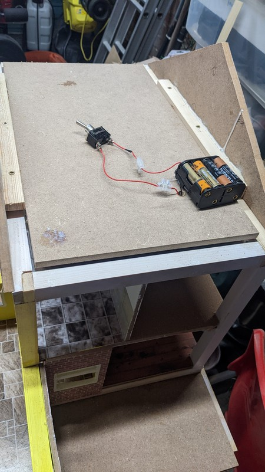](../images/dollhouse5/15.jpg)

[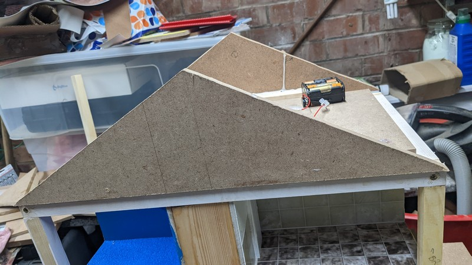](../images/dollhouse5/16.jpg)
[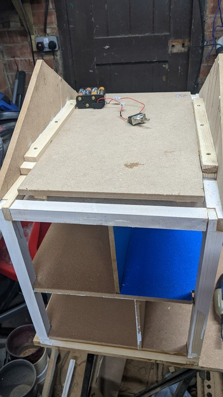](../images/dollhouse5/18.jpg)

Across one of these (The side of the house without the chimney) I place one cutout bit of wood as the roof:

[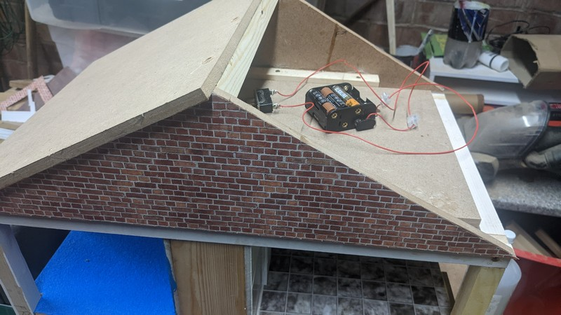](../images/dollhouse5/21.jpg)            

I take the same sized block of wood and saw it down near one edge and add some hinges, filing down a slight depression for them to sit flush:

[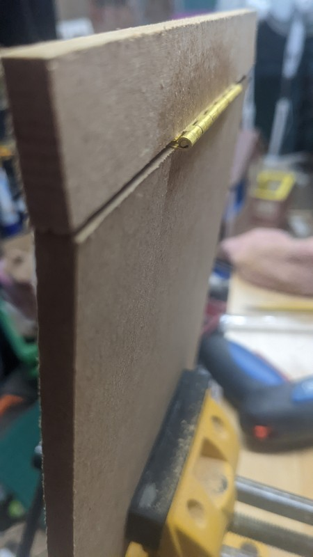](../images/dollhouse5/28.jpg)

[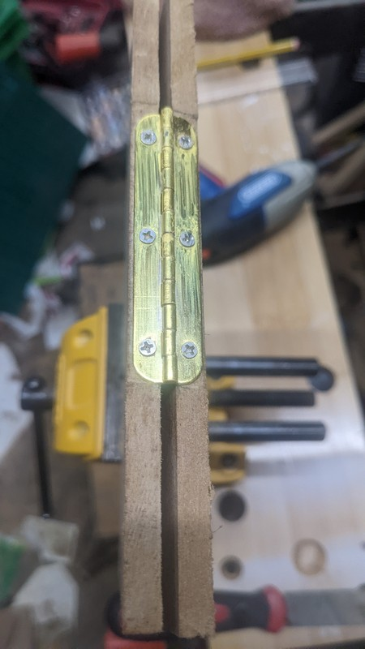](../images/dollhouse5/29.jpg)

Next I use some scraps to make an angled box for the chimney and cover this in brickwork paper and add a hinge at the shallow end:

[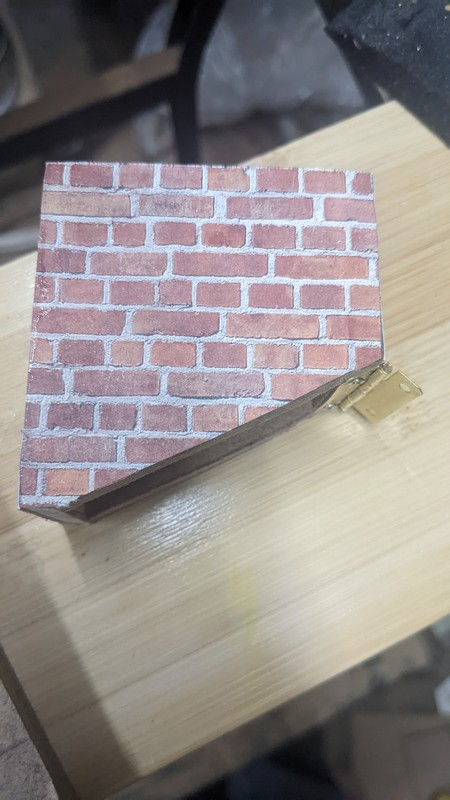](../images/dollhouse5/20.jpg)                     

I secure this to the hinged portion of the roof (after drilling a hole under where the chimney would sit) and here we have both roof access for maintenance/storage of spare bulbs etc, and a clever 60s batman style mechanism for accessing the switch to control the house lights:

[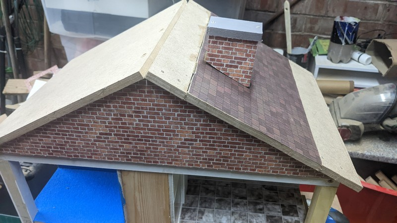](../images/dollhouse5/23.jpg)  

[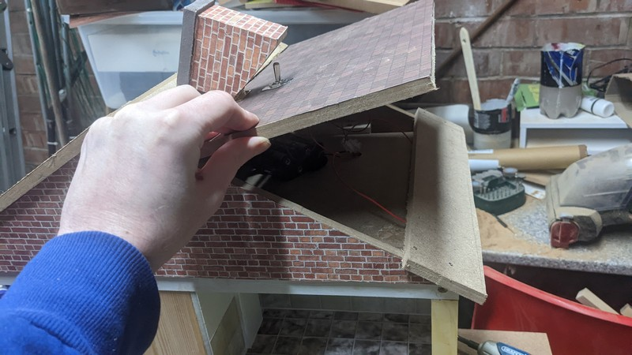](../images/dollhouse5/24.jpg)  

[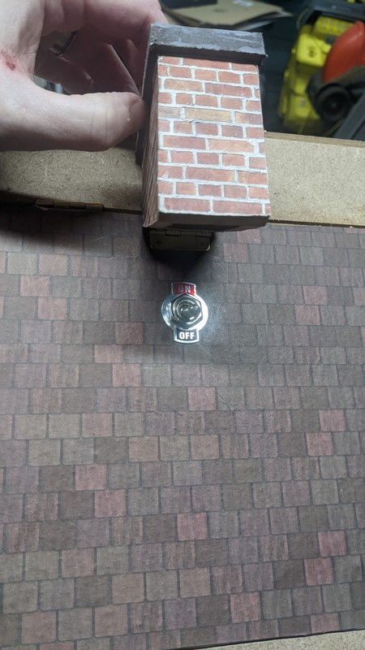](../images/dollhouse5/26.jpg)       

To fill the gap in the apex of the roof I just used some woodfiller. I could've filed an angled edge to both sides of the roof so that one lies over the other, but I was quickly running out of time:

[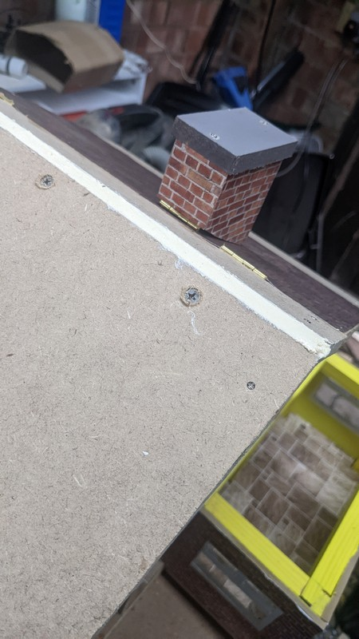](../images/dollhouse5/27.jpg)  

Next I apply rooftop-patterned paper to the roof and move onto the exterior walls and the all-important doors to play with.

# External walls and doors

Before getting to grips with the doors and surrounds, I fill in the wallspace that won't be functional in any way; I just cut some wood to match then paper over it with brick-patterned paper:

[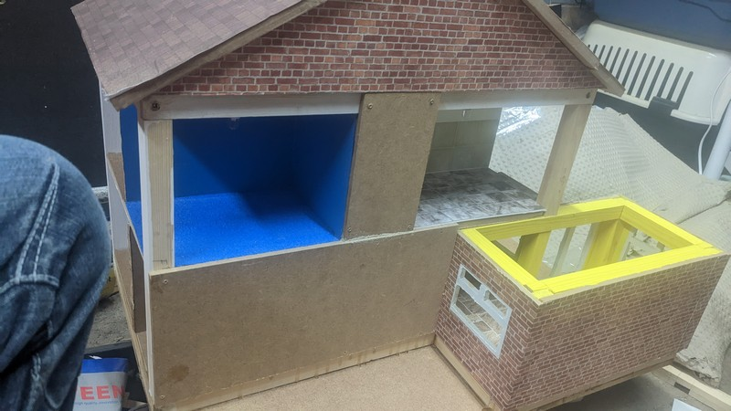](../images/dollhouse5/33.jpg)                                           
[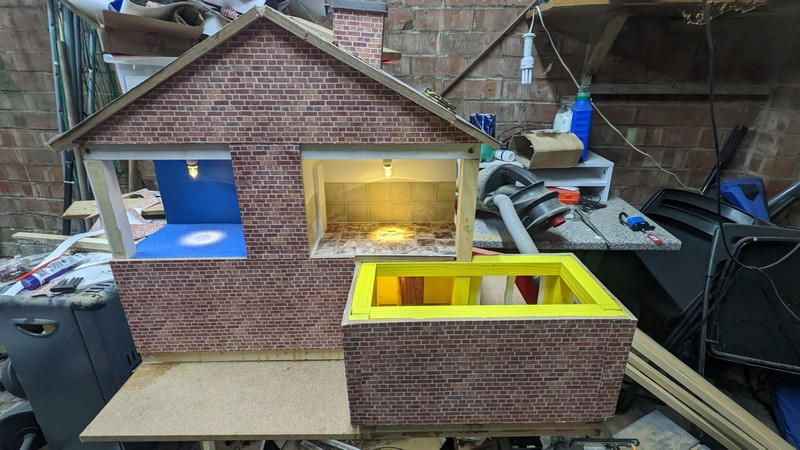](../images/dollhouse5/39.jpg)          

If we look at the top right room in the image above, we can see that there is the room, a piece of interior structure just above it (for the door to rest against) and the pillar to the left of it.

Against this pillar we will put a small panel of wall, then with a hinge to this we will attach the door:

[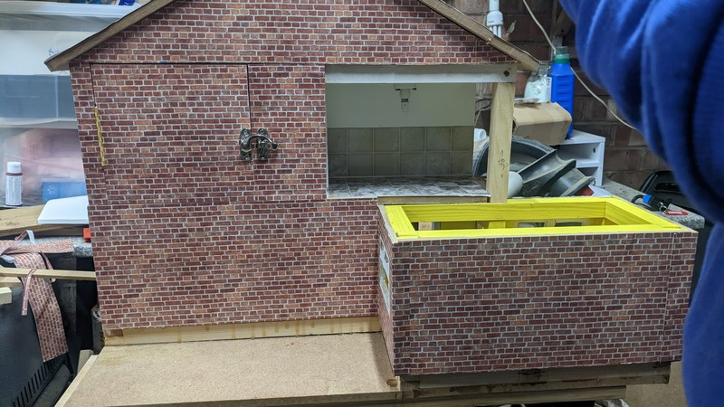](../images/dollhouse5/42.jpg)   

Now that the door opens with a hinge a bit further in rather than at the very edge of the house, both external-facing sides of the room can have a door open at once without these doors rubbing or banging against each other.

I then fitted another door to the bathroom using a different style of fastening mechanism (for each door I tried to add a different mechanism for opening and closing to keep things interesting for a 2 year old child)

[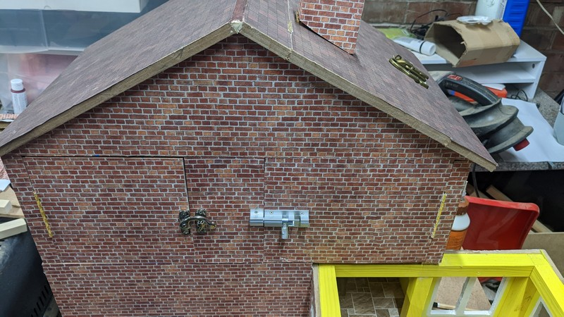](../images/dollhouse5/44.jpg)                                  
