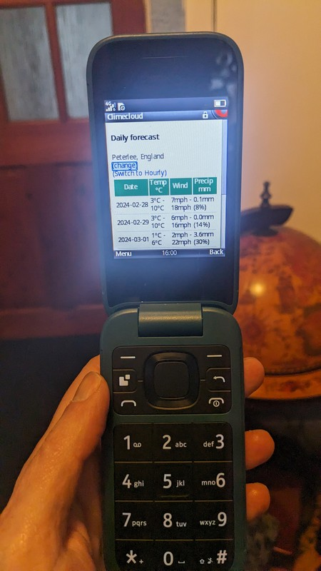
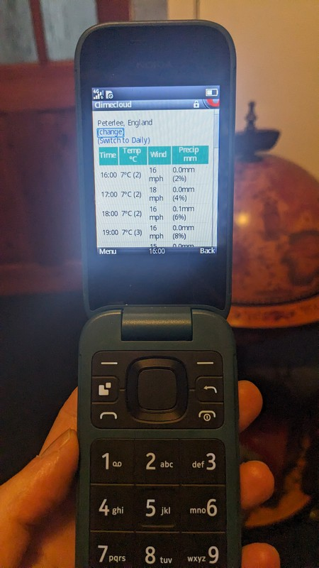

## A text-based lightweight weather website for modern feature phones

My main phone is a Nokia 2660 which does most of what I need. I use 68k.news for text-based news, the only things really missing are weather and very occasionally I miss maps.

I decided to create a text-based weather site for the device so that I can check conditions without having to just risk it. It is designed to use minimal button presses or user input, load quickly and fit on a 240x320 resolution screen.

Around 3 hours later I've now got https://clime.cloud which is now saved on my mobile.

It was created using ruby on rails, but saves user settings in a cookie as logging in etc would involve too many button presses, so the app doesn't need a database at all or store any user data in the backend.

        

The initial version works well and does everything I need for now. If I find myself missing features or spotting bugs I'll update it, but I'm trying to avoid any scope-creep or extra complexity due to its initial mission to be easy to use for feature phones.                      
