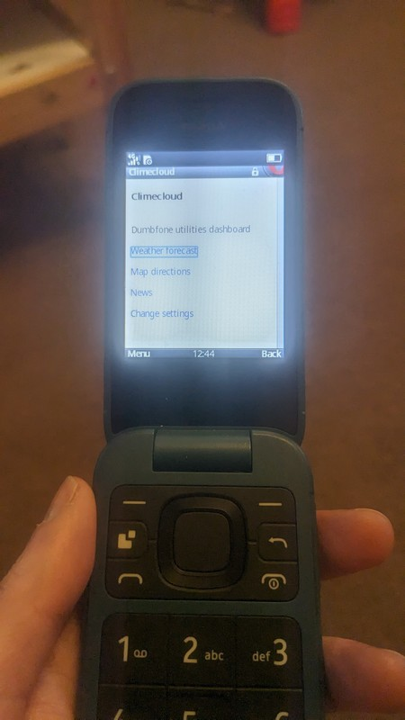
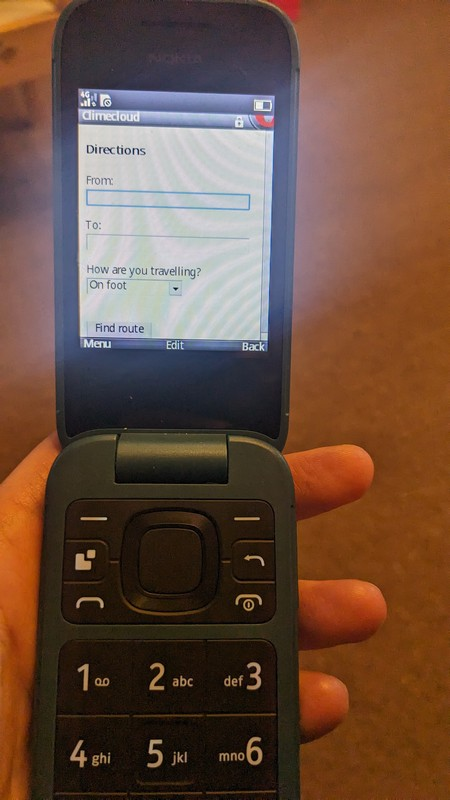
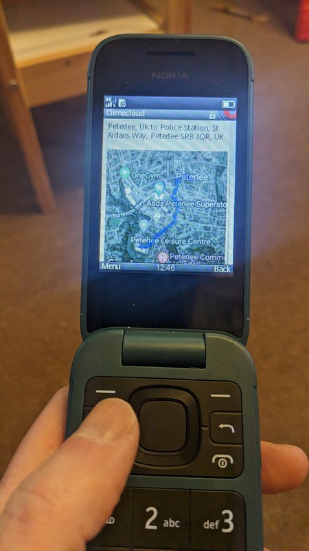
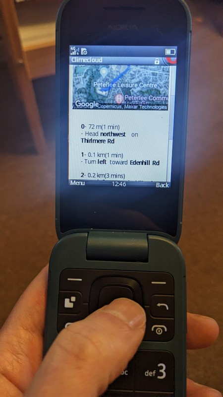

## A text-based directions finder using Google maps for dumbphones

As I said in my previous post, Maps is another feature that I always prefer to have on-hand but which aren't possible on the Nokia 2660. So I extended <https://clime.cloud> to incorporate a lightweight route planner. Again this is done in rails, so that side of things just required some new controllers and views to interact with and parse results from external APIs.

Firstly, I had to add a dashboard so that the various features can be accessed easily:

And a very simple means of telling the site where you are and where you want to go:

If requested, a small map of the route will be displayed, though this can be turned off in settings:

  

And the directions are given in text form underneath:

      

This was all done in around 2 hours including researching APIs and refactoring the existing web application, and for that effort the end result is a far more functional mobile phone.                    
