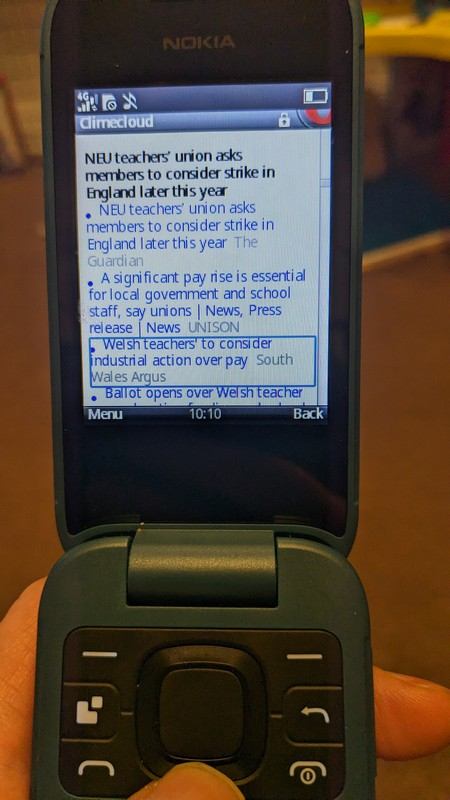
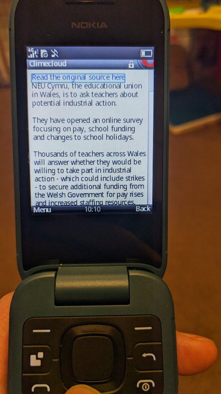

## A text-based news feed using Google news for dumbphones

I extended <https://clime.cloud> to incorporate a lightweight news feed. There are a few APIs to use to do this but in the end I just did some webscraping. After a few hours we now have a news feed which will react to the user's location  (added via the main dashboard settings page) to tailor the language and location of their feed.

Some news pages incorporate a lot of rubbish which I'm adding rules for whenever I come across it and get the time to allow only the article text to be extracted. Also a few sites are paywall-only or reject a non-javascript browser, both of these types of sites will be added to a blacklist to exclude them from the feed as I see them.

Each article will now have everything stripped out but the text. I've put a link to the original news source should people wish to follow it (And to provide accreditation and traffic to the news site) but news sites are so horribly bloated these days there's not much point in ever clicking it on a dumphone.

          
